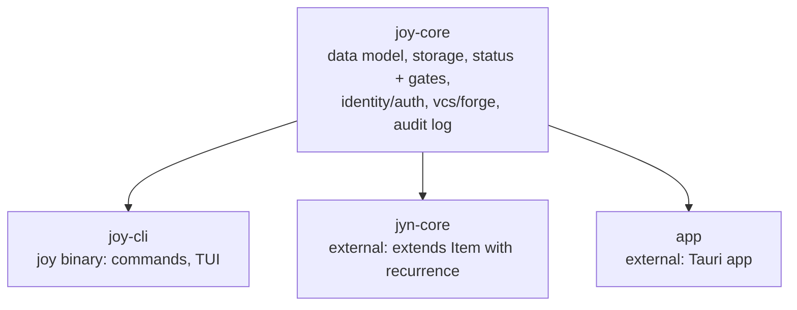

# Joy - Architecture

Joy is a terminal-native, git-native product-management tool. Its data model lives in `joy-core`, a library crate shared with [Jyn](https://github.com/joyint/jyn).

This document is an **orientation, not the specification**. The specification lives in the Joy items of this repository (`joy ls`, `joy show <ID>`), and the code is the ground truth; where this document and the code disagree, the code wins. Treat it as a first, comprehensive map, then read the items and the source.

**Cross-cutting decisions:** architecture decisions that span the Joyint ecosystem (naming, open-core licensing, terminology, the five-pillar AI governance taxonomy, the documentation and source-of-truth conventions) live as decision items in the **Joyint umbrella project** and apply here as well. Consider them alongside this repository's own decisions (`joy ls -D`).

For the product vision and data model see [VISION.md](./VISION.md); for conventions, testing, and release see [CONTRIBUTING.md](./CONTRIBUTING.md).

## Technology Stack

Rust (edition 2021, latest stable toolchain), built as a single binary. Key libraries by role: **clap** (CLI and shell completion), **ratatui** (TUI), **serde** + **serde_yml** (YAML for `.joy/` files, JSON for machine output), **thiserror** (typed errors in library crates) and **anyhow** (CLI error propagation), **insta** (snapshot tests). The exact, current versions are in [`Cargo.toml`](./Cargo.toml); this document does not restate them.

### Versioning Policy

Dependencies are pinned to their current stable major.minor. Stable minor releases are tracked and adopted promptly; major upgrades are evaluated as architecture decisions.

## Components

Two MIT-licensed crates (`crates/`):

- **joy-core** - the shared foundation. Data model (`model/`), YAML storage and project-root detection (`store.rs`), item and milestone logic with collision-safe IDs and dependency-cycle detection (`items.rs`, `milestones.rs`), status workflow and capability gates (`guard.rs`), identity and delegation auth (`identity.rs`, `member_id.rs`, `members_file.rs`, `auth/`), client-side encryption usage (`crypt.rs`; the implementation is the separate [crypt](https://github.com/joyint/crypt) project), VCS and forge integration (`vcs.rs`, `git_ops.rs`), the append-only audit log (`event_log.rs`), embedded-file sync (`embedded.rs`), templating (`templates.rs`, `ai_templates.rs`), and schema migrations (`migrations/`). Jyn's `jyn-core` depends on this crate and extends `Item` with recurrence.
- **joy-cli** - the `joy` binary: CLI commands (`commands/`, clap), the TUI (ratatui), semantic colour output, shell completion, and forge and release helpers.

AI members use Joy the way humans do: an AI agent (for example Claude Code) invokes the `joy` CLI for its work on the item store - `joy show`, `joy ls`, `joy add`, `joy comment` - and `joy-core` governs those calls exactly as it governs a human caller (capabilities, status gates and `allow_ai`, signed delegation, and the audit log). The agent's execution sandbox and orchestration, and the platform's server side, live in the separate, commercially licensed [platform](https://github.com/joyint/platform) and [app](https://github.com/joyint/app) projects.



Multiple CLI instances can run at once; each reads and writes individual YAML files, and file-level locking in `joy-core` prevents concurrent writes to the same item.

## Repository Structure

```
joy/
├── Cargo.toml              # workspace root (members, shared deps)
├── README.md  VISION.md  ARCHITECTURE.md  CONTRIBUTING.md  SECURITY.md
├── crates/
│   ├── joy-core/           # shared library (data model, storage, auth, vcs, guard)
│   ├── joy-cli/            # the `joy` binary (commands, TUI)
│   └── joy-ai/             # AI tool dispatch, job tracking
├── docs/                   # public, longer-form docs (e.g. user/Tutorial.md)
├── tests/                  # integration and snapshot tests
├── .github/workflows/      # CI
└── justfile                # task runner
```

## Sync and Data Flow

The CLI and the Tauri app operate on a local `.joy/` directory through `joy-core` as a Rust library, reading and writing the files directly. Synchronisation uses Git directly: `git push` / `git pull` to a Git remote. Git is the sync backend - the data is versioned YAML carried as Git history (see `JOY-01CC-94 - ADR: Git as sync backend` for the rationale). The platform's server-side services (auth, billing, forge management, CalDAV, notifications, AI proxy) are a separate project reached over gRPC, and are out of scope here.

## Security

- **Credentials and configuration.** Secrets live in `credentials.yaml` (gitignored, `0600`); settings live in `config.yaml` (committed). Both exist at a global level (`~/.config/joy/`) and a project level (`.joy/`), with project values overriding global ones.
- **Identity and authorization.** Identity is the e-mail address (`git config user.email` locally, OAuth on the server); AI members use a synthetic `ai:tool@joy` identity. Human-to-AI delegation uses per-delegator, per-session tokens. See the auth decisions `JOY-01CD-DA`, `JOY-01E0-2E`, `JOY-01E1-E7`, and `JOY-01E3-6B` (pseudonymized identity for GDPR erasure).
- **Encryption.** Project data can be selectively end-to-end encrypted on the client; `joy-core` consumes the encryption layer, whose implementation is the [crypt](https://github.com/joyint/crypt) project.
- **Runtime gates.** `joy-core/src/guard.rs` is the single point that enforces status-transition gates, capabilities, and the `allow_ai` flag (for example, AI can create items but a human approves them into the backlog).
- **AI governance.** Joy's governance rests on five pillars (Trustship, Guardianship, Orchestration, Traceability, Settlement); see [VISION.md](./VISION.md#ai-governance-the-five-pillars).

## Configuration Reference

Configuration is data, not code, and is not restated here. The authoritative shapes are the committed template files: `.joy/project.yaml` (roles, status-rule gates) and `.joy/config.yaml` (sync, output, AI tool settings) follow the templates under `joy-core`'s `data/` (`project.defaults.yaml` and `items/_base.yaml`). Roles are e-mail addresses. Item IDs are not stored; the next ID is derived at runtime from existing filenames, prefixed with the project acronym (`ACRONYM-XXXX`, `ACRONYM-MS-XX` for milestones).

## Architecture Decisions

Architecture decisions are Joy **decision items in this repository**, each titled `ADR: ...`. Run `joy ls -D` for the current list and `joy show <ID>` for context. Foundational ones:

- `JOY-01CA-FA - ADR: YAML over SQLite for data storage`
- `JOY-01CC-94 - ADR: Git as sync backend`
- `JOY-01CE-88 - ADR: VCS abstraction layer`
- `JOY-01CF-48 - ADR: YAML-aware merge strategy for conflict resolution`
- `JOY-01D0-EB - ADR: .joy/ directory versioning policy`
- `JOY-01D4-42 - ADR: Capabilities over roles for AI agent abstraction`
- `JOY-01D7-4C - ADR: Guard as a joy-core module for centralized runtime validation`
- `JOY-01DC-E4 - ADR: Collision-safe item IDs with title-hash suffix`
- `JOY-01CD-DA - ADR: E-mail as user identity with OAuth authentication`
- `JOY-01E3-6B - ADR: Pseudonymized member identity for GDPR erasure`

Ecosystem-wide decisions (naming, open-core licensing, terminology, AI governance taxonomy, documentation and source-of-truth conventions) live in the Joyint umbrella project and also apply.

## Performance Targets

- `joy` overview: < 100 ms on a project with 100 items
- `joy ls`: < 50 ms for an unfiltered list
- `joy add`: < 200 ms including file write and Git staging
- Binary size: < 10 MB for the CLI and TUI

## References

- [VISION.md](./VISION.md), [CONTRIBUTING.md](./CONTRIBUTING.md), [SECURITY.md](./SECURITY.md)
- [Joyint umbrella project](https://github.com/joyint/project) - cross-cutting decisions and ecosystem docs
- [Jyn](https://github.com/joyint/jyn) - consumer of `joy-core`; [crypt](https://github.com/joyint/crypt), [platform](https://github.com/joyint/platform), [app](https://github.com/joyint/app)
- ForgeSync (Joy CLI sync concept): a public `docs/` document is being reconciled to the current sync model (tracked as `JI-013C-AC`).
