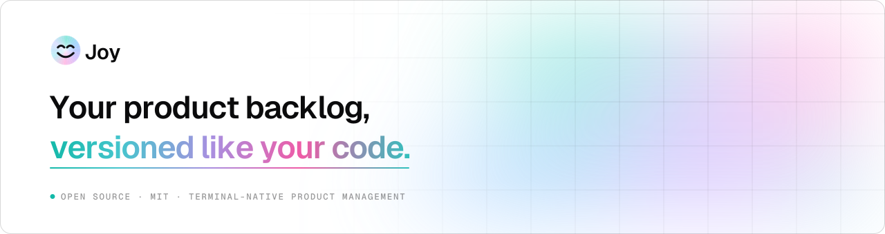
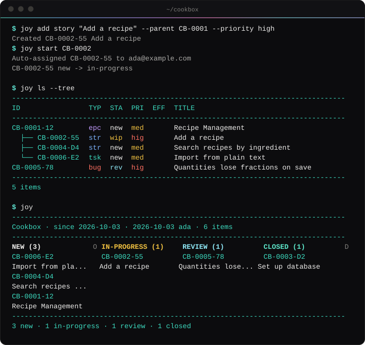

<p align="center">
  <picture>
    <source media="(prefers-color-scheme: dark)" srcset="docs/assets/banner-dark.svg">
    
  </picture>
</p>

<p align="center">
  <a href="https://github.com/joyint/joy/releases/latest"></a>
  <a href="https://crates.io/crates/joy-cli"></a>
  <a href="https://github.com/joyint/joy/actions/workflows/ci.yaml"></a>
  <a href="./LICENSE"></a>
</p>

<p align="center">
  <a href="#install">Install</a> ·
  <a href="#quick-start">Quick start</a> ·
  <a href="#working-with-ai-tools">AI tools</a> ·
  <a href="docs/user/Tutorial.md">Tutorial</a> ·
  <a href="#documentation">Docs</a>
</p>

# Joy

**Terminal-native product management that lives in your Git repo.**

Joy is a single Rust binary that keeps your backlog next to your code: epics, stories, tasks, bugs, milestones and decisions are YAML files in `.joy/`, versioned with Git. No server, no account, no browser tab. Your AI coding tools work the same backlog, under an identity of their own and with a log of who did what.

<p align="center">
  
</p>

## Why Joy

- **Your backlog is in the repo.** An item is a small YAML file. It branches, merges and reviews like code, and `git log` is its history. Clone the repo and you have the whole project, offline.
- **It merges.** Two branches that touch the same item combine field by field instead of leaving conflict markers. `joy init` sets this up locally and writes a CI job so the merge button on GitHub, GitLab and Gitea works too.
- **AI tools are members, not ghosts.** `joy ai init` sets up Claude Code, GitHub Copilot, Qwen Code, Mistral Vibe and Google Antigravity. Each one acts as `ai:<name>@joy` under a delegation token you issue, and every change records who delegated it.
- **Fast and scriptable.** Ten core commands cover daily use, every command takes `--json`, and a commit-msg hook ties commits to items.
- **Private where it has to be.** `joy crypt add` encrypts single items or paths end to end. They stay ciphertext in the working directory, in every commit and on the forge.

## Install

macOS / Linux:

```sh
curl -fsSL get.joyint.com/joy | sh
```

Windows:

```powershell
winget install -s winget joyint.joy
```

From source:

```sh
cargo install joy-cli
```

<details>
<summary>Windows without winget, PATH and updates</summary>

```powershell
irm get.joyint.com/joy.ps1 | iex
```

The script installers drop the binary into `~/.local/bin`. The Windows script also adds that directory to your user PATH (no administrator rights required); on macOS / Linux add it yourself if it isn't already (`export PATH="$HOME/.local/bin:$PATH"` in your shell rc). A winget install is managed by winget and updates with `winget upgrade`; a script install updates with `joy update`.

</details>

## Quick start

```sh
cd my-project && joy init

joy add epic "User accounts"
joy add story "User login" --parent MY-0001 --priority high
joy start MY-0002        # -> in-progress, assigned to you
joy submit MY-0002       # -> review
joy close MY-0002
joy                      # the board
```

What that leaves in your repository is plain text:

```yaml
# .joy/items/MY-0002-55-user-login.yaml
id: MY-0002-55
title: User login
type: story
status: closed
priority: high
parent: MY-0001-12
```

Item ids carry a short suffix (`MY-0002-55`); in commands the number is enough.

`joy tutorial` walks through the rest: dependencies, milestones, releases, members and capabilities.

### Joining an existing project

```sh
git clone <repo-url> && cd <repo>
joy init     # installs commit-msg hook, sets up git hooks path
joy ai init  # optional: configure AI tool integration
```

`joy init` detects the existing project and switches to onboarding mode - it installs the commit-msg hook and sets `core.hooksPath` without touching project data. If your repository already had hooks (husky, lefthook, pre-commit), Joy remembers their path and runs them after its own check, and says so once.

## Working with AI tools

```sh
joy ai init
```

This detects the AI coding tools you have installed, writes their instruction files and the `/joy` skill, and registers each tool as a project member. From then on an agent picks up items, moves them through the workflow and comments like anyone else on the team, and the event log shows it:

```
[ai:claude@joy delegated-by:you@example.com]
```

AI members can do what you allow them to (plan, implement, review, ...), but never manage the project: adding members and changing settings stays with humans. `joy ai tutorial` is the guide the agents read themselves.

## What else is in the box

| | |
|---|---|
| **Boards and views** | `joy` for the board, `joy ls --tree`, `joy roadmap`, `joy find`, `joy -D` for decisions |
| **Milestones and releases** | `joy milestone`, and `joy release` to bump versions, write the release record and publish to your forge |
| **Audit log** | `joy log` - an append-only event log, versioned with the project |
| **Members and gates** | capabilities per member, status rules that require a human sign-off |
| **Encryption** | `joy crypt` - selective end-to-end encryption of items and paths |
| **Team chats** | `joy chat` - sealed chats that live in the repository |
| **Forges** | `joy forge login` for GitHub, GitLab and Gitea |
| **Plugins** | any `joy-<name>` executable on your PATH, see [Plugins](docs/plugins.md) |

## Documentation

- [Tutorial](docs/user/Tutorial.md) - the full walk-through, also available as `joy tutorial`
- [VISION.md](./VISION.md) - product vision and data model
- [ARCHITECTURE.md](./ARCHITECTURE.md) - technical overview
- [CONTRIBUTING.md](./CONTRIBUTING.md) - conventions, testing, release
- [Plugins](docs/plugins.md) - writing `joy-<name>` plugins (joy-bi is the reference), and the forge connector contract
- [Upgrading](docs/migration/forge-connection-ng.md) - what an upgrade across the forge connection rebuild does with what is already on your machine

Architecture decisions are tracked as Joy decision items in this repository; run `joy ls -D` to list them.

## Status

Joy is pre-1.0 and under active development. It is built and managed with itself: the backlog of this repository is in [`.joy/`](./.joy), so `joy` in a clone shows you what we are working on.

Joy is part of the [Joyint](https://github.com/joyint) ecosystem.

## License

MIT. See [LICENSE](./LICENSE).
