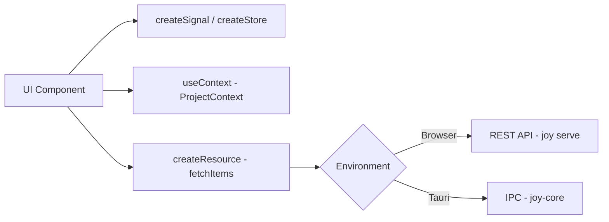
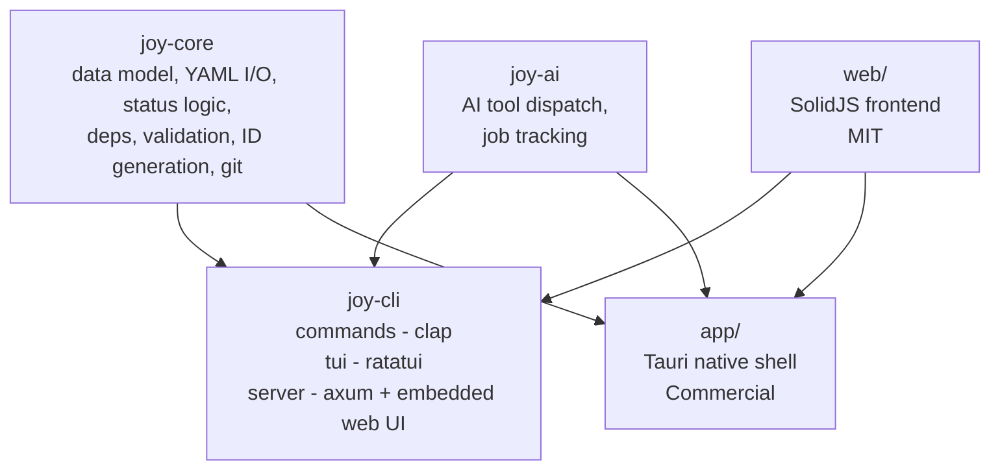

# Joy — Architecture

This document defines the technical foundation for the Joy project. It covers technology choices, repository structure, coding standards, testing strategy, and build/release pipeline.

For product vision, data model, and CLI design see [Vision.md](./Vision.md).

---

## Technology Stack

### Versioning Policy

Pin all dependencies to their current stable **major.minor** version. Track stable minor releases and update promptly (within 1 week of release). Major version upgrades are evaluated as ADRs.

### Core (CLI + TUI + Server)

| Component                    | Version              | Rationale                                                         |
| ---------------------------- | -------------------- | ----------------------------------------------------------------- |
| **Rust**                     | 1.85 (latest stable) | Performance, single binary, type safety, memory safety            |
| **clap** (derive API)        | 4.5                  | De-facto CLI standard, shell completions, derive macros           |
| **ratatui**                  | 0.29                 | TUI framework, ships in same binary as CLI                        |
| **axum**                     | 0.8                  | Async HTTP, tower-based, consistent Rust ecosystem                |
| **serde** + **serde_yml**    | 1.0 / 0.0.12         | YAML for `.joy/` files, JSON for API. 0.0.x is the current stable fork of the deprecated `serde_yaml` -- re-evaluate if a breaking change occurs |
| **tokio**                    | 1.43                 | Async runtime for server, sync, AI jobs                           |
| **thiserror**                | 2.0                  | Explicit error types in library crates                            |
| **anyhow**                   | 1.0                  | Convenient error handling in binary crate                         |
| **clap_complete**            | 4.5                  | Shell completion generation (bash, zsh, fish, PowerShell, elvish) |
| **console** / **owo-colors** | latest               | Terminal colors and styling                                       |
| **insta**                    | 1.41                 | Snapshot testing                                                  |

### App (Desktop + Mobile + Web)

| Component        | Version     | Rationale                                                                              |
| ---------------- | ----------- | -------------------------------------------------------------------------------------- |
| **Tauri**        | 2.10        | Single codebase: desktop (macOS, Linux, Windows) + mobile (iOS, Android), Rust backend |
| **SolidJS**      | 1.9         | Reactive, fine-grained updates, lightweight. Upgrade to 2.x when stable                |
| **TypeScript**   | 5.7         | Strict mode, type safety                                                               |
| **Vite**         | 6.2         | Fast HMR, native ESM, excellent Tauri integration                                      |
| **Tailwind CSS** | 4.0         | Utility-first, consistent design, rapid iteration                                      |
| **Yarn**         | 4.x (Berry) | Fast, deterministic, PnP support. Tauri fully supports Yarn                            |

### State Management (SolidJS)

Follow the SolidJS state management patterns as documented in the official guides:

**Local state** via `createSignal` and `createStore` for component-level reactivity. **Shared state** via context providers (`createContext` + `useContext`) for cross-component state like the current project, active filters, or user settings. **Server state** via `createResource` for async data fetching. No external state management library -- SolidJS primitives are sufficient and keep the dependency footprint minimal.

The web frontend uses a single API client abstraction. In the browser (`joy serve`), it calls the REST API. In the Tauri native app, it calls Tauri IPC commands (which delegate to `joy-core` directly).



### Shared Logic

The Rust core library (`joy-core`) is shared between CLI, TUI, server, and Tauri backend. This ensures consistent behavior across all interfaces.

The SolidJS web frontend lives in `web/` and is shared between `joy serve` (embedded as static files) and the Tauri native app (which wraps it). This means self-hosted and native users get the same UI.



`joy-ai` is a library crate used by both `joy-cli` and `joy-app`.

Note: There is no separate server binary. `joy serve` is a subcommand of the `joy` CLI binary. It serves the REST API and the web UI. It can run in the foreground or as a background daemon (`joy serve --daemon`). The axum server and embedded web assets are compiled into the main binary behind the `server` feature flag to keep the default binary lean.

Multiple CLI instances can run simultaneously — each reads/writes individual YAML files. File-level locking in `joy-core` prevents concurrent writes to the same item. The server serializes writes when running.

---

## Repository

GitHub organization: [github.com/joyint](https://github.com/joyint)

Main repository: `joyint/joy` (monorepo). Separate repos only for truly independent concerns: `joyint/homebrew-tap` (Homebrew formula), `joyint/joyint.com` (portal deployment/infra, if separate from app code).

### Structure

Monorepo with Cargo workspace for Rust crates and a separate directory for the Tauri/SolidJS frontend. This is the target structure -- directories and files are created as the corresponding features are implemented.

```
joy/
├── Cargo.toml                  # Workspace root
├── Cargo.lock
├── LICENSE                      # MIT license (everything except app/)
├── .joy/                       # Joy manages itself (dogfooding)
├── docs/
│   ├── user/
│   │   └── Tutorial.md         # Getting started walkthrough
│   └── dev/
│       ├── Vision.md
│       ├── Architecture.md
│       ├── CONTRIBUTING.md
│       ├── (Backlog.md removed in v0.5.0 -- managed with Joy itself)
│       └── adr/                # Architecture Decision Records
│           ├── ADR-001-yaml-over-sqlite.md
│           ├── ADR-002-single-binary.md
│           └── ...
├── crates/
│   ├── joy-core/               # Shared library: data model, YAML I/O, logic
│   │   ├── Cargo.toml
│   │   └── src/
│   │       ├── lib.rs
│   │       ├── model/          # Item, Milestone, Project structs
│   │       ├── store.rs        # YAML file read/write, project root detection
│   │       ├── items.rs        # Item CRUD, ID generation, dependency cycle detection
│   │       ├── milestones.rs   # Milestone CRUD, ID generation
│   │       ├── init.rs         # Project initialization
│   │       └── error.rs        # Error types (thiserror)
│   ├── joy-cli/                # CLI binary (clap) -- includes TUI and server
│   │   ├── Cargo.toml
│   │   └── src/
│   │       ├── main.rs
│   │       ├── commands/       # One module per command (add, ls, status, rm, deps, ...)
│   │       ├── color.rs        # Semantic terminal colors
│   │       ├── tui/            # ratatui views (behind feature flag, planned)
│   │       └── server/         # axum server for `joy serve` (behind feature flag, planned)
│   └── joy-ai/                 # AI tool dispatch, job tracking
│       ├── Cargo.toml
│       └── src/
├── web/                        # SolidJS web frontend [MIT]
│   ├── package.json
│   ├── yarn.lock
│   ├── tsconfig.json
│   ├── vite.config.ts
│   ├── tailwind.config.ts
│   └── src/
│       ├── App.tsx
│       ├── index.tsx
│       ├── components/
│       ├── views/
│       ├── context/            # SolidJS context providers
│       └── lib/                # API client, utils
├── app/                        # Tauri native shell [Commercial]
│   ├── LICENSE                 # Commercial (Joydev GmbH)
│   ├── src-tauri/              # Tauri Rust backend
│   │   ├── Cargo.toml          # Depends on joy-core
│   │   └── src/
├── tests/                      # Integration & E2E tests
│   ├── cli/                    # CLI integration tests
│   ├── api/                    # API integration tests
│   └── fixtures/               # Test data (.joy/ directories)
├── .github/
│   └── workflows/              # CI/CD
├── .claude/                    # Claude Code context
│   └── CLAUDE.md
├── justfile                    # Task runner (just)
└── README.md
```

### Cargo Workspace Configuration

```toml
# Cargo.toml (workspace root)
[workspace]
resolver = "2"
members = [
    "crates/joy-core",
    "crates/joy-cli",
    "crates/joy-ai",
    "app/src-tauri",
]

[workspace.dependencies]
serde = { version = "1.0", features = ["derive"] }
serde_yml = "0.0.12"
serde_json = "1.0"
tokio = { version = "1.43", features = ["full"] }
thiserror = "2.0"
anyhow = "1.0"
clap = { version = "4.5", features = ["derive"] }
```

Feature flags in `joy-cli/Cargo.toml`:

```toml
[features]
default = ["tui"]
tui = ["dep:ratatui", "dep:crossterm"]
server = ["dep:axum", "dep:tower-http"]
full = ["tui", "server"]
```

All Rust crates and the web frontend are MIT-licensed. Only the Tauri native shell (`app/`) is proprietary (see [ADR-008](./adr/ADR-008-open-core-licensing.md)). `cargo install joyint --features full` produces a fully MIT binary including server and embedded web UI.

---

## Coding Conventions, Testing & CI/CD

See [CONTRIBUTING.md](./CONTRIBUTING.md) for coding conventions (Rust and TypeScript), testing strategy, CI/CD pipeline, and the task runner configuration.

---

## Security

### Credentials

Secrets (API keys, OAuth tokens) are stored in `credentials.yaml`. Configuration (settings, AI tool config, output preferences) is stored in `config.yaml`. Both support two levels:

| File | Global (`~/.config/joy/`) | Project (`.joy/`) |
| ---- | ------------------- | ----------------- |
| `config.yaml` | User defaults | Project-specific, committed to Git |
| `credentials.yaml` | User defaults | Project-specific, gitignored |

Project-local values override global defaults. File permissions for `credentials.yaml` are 0600.

**Sync authentication** uses OAuth 2.0 with the user's e-mail address as the stable identifier (see [ADR-009](./adr/ADR-009-email-identity-oauth.md)). Supported OAuth providers:

| Provider | Priority | Notes |
| -------- | -------- | ----- |
| GitHub   | P0       | Primary provider, covers most of the target audience |
| Gitea    | P0       | Self-hosted Git, aligns with self-hosted Joy servers |

The server issues JWTs after OAuth login. Tokens are stored in OS keychain where available (via `keyring` crate), fallback to `credentials.yaml` (global or project-local). Additional OAuth providers (GitLab, Google, Microsoft) can be added later without migration -- the e-mail address is the identity, not the provider.

### End-to-End Encryption (v2)

End-to-end encryption is planned for v2. In v1, sync operates over HTTPS without content encryption. Projects should use private repositories and authenticated server connections.

The v2 design is documented in [ADR-006](./adr/ADR-006-client-side-encryption.md): AES-256-GCM per project, key stored in `~/.config/joy/keys/{project-id}.key`, cleartext metadata for server-side dashboards, Web Crypto API for browser compatibility.

### Agent Sandboxing

AI agents executing code operate in controlled environments. Joy tracks what each agent is allowed to do (create branch, commit, push) — no implicit permissions.

---

## Architecture Decision Records (ADRs)

Significant architectural decisions are documented as individual files in `docs/dev/adr/`. Format follows the Michael Nygard template: Title, Status, Context, Decision, Consequences.

- [ADR-001: YAML over SQLite for data storage](./adr/ADR-001-yaml-over-sqlite.md)
- [ADR-002: Single binary with feature flags](./adr/ADR-002-single-binary.md)
- [ADR-003: Tauri for multi-platform app](./adr/ADR-003-tauri-multi-platform.md)
- [ADR-004: Portal as source of truth for sync](./adr/ADR-004-portal-source-of-truth.md)
- [ADR-005: Package name `joyint`, binary name `joy`](./adr/ADR-005-package-name-joyint.md)
- [ADR-006: Client-side encryption with cleartext metadata](./adr/ADR-006-client-side-encryption.md)
- [ADR-007: Yarn over npm](./adr/ADR-007-yarn-over-npm.md)
- [ADR-008: Open Core Licensing Model](./adr/ADR-008-open-core-licensing.md)
- [ADR-009: E-mail as user identity with OAuth authentication](./adr/ADR-009-email-identity-oauth.md)
- [ADR-010: VCS abstraction layer](./adr/ADR-010-vcs-abstraction.md)

---

## Configuration Reference

### Config (`~/.config/joy/config.yaml` and `.joy/config.yaml`)

```yaml
# .joy/config.yaml (project-local, committed)
version: 1 # Config schema version

sync:
  remote: https://joyint.com/joydev/platform
  auto: false

output:
  color: auto # auto | always | never
  emoji: true # true | false

ai:
  tool: claude-code            # claude-code | mistral-vibe | github-copilot | qwen-code
  command: claude              # CLI command to invoke
  model: auto                  # model name or "auto" (tool default)
  max_cost_per_job: 10.00
  currency: EUR
```

Global defaults in `~/.config/joy/config.yaml` use the same structure. Project-local values override global values per field.

### Credentials (`~/.config/joy/credentials.yaml` and `.joy/credentials.yaml`)

```yaml
# ~/.config/joy/credentials.yaml (global) or .joy/credentials.yaml (project-local, gitignored)
ai:
  api_key: sk-ant-...
sync:
  token: eyJ...
```

IDs are not stored in config. The next available ID is derived at runtime by scanning existing filenames (e.g. all files in `.joy/items/`) and incrementing the highest found value. This eliminates redundancy and avoids sync conflicts on a shared counter. IDs use the project acronym as prefix: ACRONYM-0001 to ACRONYM-FFFF for items (all types share one number space), ACRONYM-MS-01 to ACRONYM-MS-FF for milestones.

### Project Roles and Status Rules (`.joy/project.yaml`)

```yaml
# .joy/project.yaml
roles:
  approver: [horst@joydev.com, anna@joydev.com]

status_rules:
  new -> open:
    requires_role: approver   # only approvers can move items into the backlog
    allow_ai: false           # AI agents cannot triage items
  review -> closed:
    requires_role: approver   # only approvers can accept items
    requires_ci: true         # branch CI must be green
    allow_ai: false           # AI agents cannot close items
```

Role members are identified by e-mail address, matching `git config user.email` locally and the OAuth-provided e-mail on the server. See [Vision.md](./Vision.md#user-identity) for the identity model.

Status rules are optional. Without them, all transitions are unrestricted. Each rule can combine `requires_role` (list of role names from `roles`), `requires_ci` (branch protection check), and `allow_ai` (whether AI agents may perform this transition). See [Vision.md](./Vision.md#status-rules) for the workflow context.

---

## Performance Targets

- `joy` (overview): <100ms on a project with 100 items
- `joy ls`: <50ms for unfiltered list
- `joy add`: <200ms including file write and git staging
- `joy sync`: <2s for incremental sync of 10 changed items
- Binary size: <10MB for CLI+TUI, <20MB with server feature
- App startup: <1s to interactive on desktop
