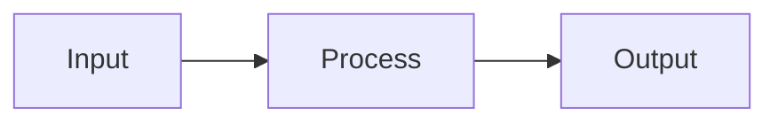

# Joy -- Contributing

This document covers the day-to-day process of working on Joy: coding conventions, testing, CI/CD, documentation rules, and the task runner.

For product vision and data model see [Vision.md](./Vision.md). For technology choices and architecture see [Architecture.md](./Architecture.md).

The product backlog lives in `.joy/items/` and is managed entirely with the `joy` CLI since v0.5.0. Run `joy` for a board overview, `joy ls` to list items, `joy show <ID>` for details.

---

## Documentation Rules

All project documentation (Markdown files, README, ADRs, code comments) must follow these rules:

**No emoji in technical documentation.** Emoji are a runtime feature of the CLI (configurable, deactivatable). They do not belong in technical docs (Vision, Architecture, ADRs, code comments) or commit messages. README.md and user-facing materials may use emoji sparingly for warmth.

**No ASCII diagrams.** Always use Mermaid for diagrams. This applies to architecture diagrams, flowcharts, state machines, sequence diagrams, and any other visual representation. Mermaid renders natively on GitHub, in most editors, and in documentation tools.



**No ASCII box-drawing** for architecture or flow visualizations. File tree listings (using standard `tree` output characters) are acceptable because they represent actual file system structure, not abstract concepts.

---

## Coding Conventions

**Fix root causes, not symptoms.** Do not add workarounds, feature flags, or conditional logic for temporary problems. If something is missing, create it. If something is broken, fix it. The codebase should always reflect the intended state, not the current gaps.

### Rust

**Edition:** 2021 (or latest stable)

**Formatting:** `rustfmt` with default settings. No custom overrides -- consistency over preference.

**Linting:** `clippy` at `warn` level in CI, with `#[deny(clippy::all)]` in library crates. Pedantic lints enabled selectively.

**Naming:**

- Types: `PascalCase`
- Functions/methods: `snake_case`
- Constants: `SCREAMING_SNAKE_CASE`
- Crate names: `joy-core`, `joy-cli` (kebab-case)
- Module names: `snake_case`

**Error handling:**

- `joy-core` uses `thiserror` enums -- every error type is explicit and matchable
- `joy-cli` uses `anyhow` for convenient error propagation to the user
- No `unwrap()` or `expect()` in library code. Allowed in tests and in CLI `main()` only.

**Dependencies:** Minimize. Every new dependency must justify its inclusion. Prefer stdlib and well-maintained crates with few transitive dependencies.

### TypeScript

**Strict mode:** Always. `"strict": true` in tsconfig.

**Formatting:** Prettier with default settings.

**Linting:** ESLint with `eslint-plugin-solid` and `@typescript-eslint/eslint-plugin`.

**Naming:**

- Components: `PascalCase` (`ItemCard.tsx`, `BoardView.tsx`)
- Functions/variables: `camelCase`
- Types/interfaces: `PascalCase`, no `I` prefix
- Enums: `PascalCase` with `PascalCase` members
- Files: `PascalCase.tsx` for components, `camelCase.ts` for utilities
- Context providers: `PascalCase` (`ProjectContext.tsx`)

**Imports:**

- Absolute imports via path aliases (`@/components/...`, `@/lib/...`)
- Group: external, then internal, then relative, separated by blank lines
- No default exports except for page/view components

**Type safety:**

- No `any` -- use `unknown` and narrow
- Prefer `interface` for object shapes, `type` for unions/intersections
- All Tauri IPC commands are fully typed with shared type definitions

---

## License Headers

Every source file must start with a license header. The header uses the [SPDX](https://spdx.dev/learn/handling-license-info/) format for machine-readable license identification.

**MIT files** (`joy-core`, `jot-core`, `joy-cli`, `jot-cli`, `joy-ai`):

```rust
// Copyright (c) 2026 Joydev GmbH (joydev.com)
// SPDX-License-Identifier: MIT
```

**Commercial files** (`web/`, `app/`, `server/`):

```rust
// Copyright (c) 2026 Joydev GmbH (joydev.com)
// SPDX-License-Identifier: LicenseRef-Commercial
```

The header goes on the first line of the file, before any `#![...]` attributes, imports, or code. One blank line separates the header from the rest of the file. Core and CLI crates (`joy-core`, `jot-core`, `joy-cli`, `jot-cli`, `joy-ai`) are MIT. Server components (`server/`), web frontend (`web/`), and native app (`app/`) are commercially licensed. See [ADR-008](./adr/ADR-008-open-core-licensing.md).

---

## Testing Strategy

### Philosophy

**Test-Driven Development (TDD)** is the default workflow. Write the test first, watch it fail, implement the minimum to pass, refactor. This applies especially to `joy-core` where correctness of the data model and status logic is critical.

### Test Levels

**Unit tests** (Rust `#[cfg(test)]` modules):

- Every public function in `joy-core` has unit tests
- Data model serialization/deserialization roundtrips
- Status transition validation
- Dependency cycle detection
- ID generation and collision prevention

**Integration tests** (`tests/` directory):

- CLI command execution against real `.joy/` directories
- Full workflows: init, add, status, deps, ls
- Server API endpoint tests with `axum::test` helpers
- Sync protocol tests

**Snapshot tests** (for CLI output):

- `joy ls`, `joy show`, `joy` overview output is snapshot-tested with `insta`
- Ensures formatting changes are intentional
- Both color and no-color variants

**E2E tests** (for app, later phases):

- Tauri app interaction tests
- Cross-platform smoke tests via CI matrix

### TypeScript Tests

- **Unit tests:** Vitest for utility functions and IPC wrappers
- **Component tests:** Vitest + `@solidjs/testing-library` for SolidJS components
- **E2E:** Playwright (later phases)

### Test Commands

```sh
just test              # Run all tests (Rust + TS)
just test-unit         # Rust unit tests only
just test-int          # Integration tests only
just test-snap         # Snapshot tests (update with just test-snap-update)
just test-app          # TypeScript tests
just test-coverage     # With coverage report
just test-watch        # Re-run on file change
```

### Coverage Target

Aim for >80% line coverage on `joy-core`. No hard enforcement -- coverage is a signal, not a goal. Untested edge cases matter more than percentage points.

---

## CI/CD and Release Pipeline

### Continuous Integration

Every push and pull request triggers:

1. **Format check** -- `cargo fmt --check` + `yarn prettier --check` + `yarn eslint`
2. **Lint** -- `cargo clippy -- -D warnings`
3. **Test** -- Full test suite (unit + integration + snapshots)
4. **Build** -- Debug build for all targets

### Release Pipeline

Releases are triggered by Git tags (`v0.1.0`, `v1.0.0`, etc.).

**Build matrix:**

| Target | OS | Arch |
|--------|----|------|
| CLI binary | Linux, macOS, Windows | x86_64, aarch64 |
| Tauri desktop app | Linux, macOS, Windows | x86_64, aarch64 |
| Tauri mobile app | iOS, Android | aarch64 |

**Artifacts:**

- Standalone binaries (tar.gz, zip)
- Homebrew formula: `brew install joydev/tap/joyint`
- Cargo install: `cargo install joyint`
- Tauri app bundles (.dmg, .AppImage, .msi)
- Mobile app packages (.apk, .ipa)

**Signing and checksums:**

- SHA256 checksums for all artifacts
- Code signing for macOS and Windows binaries
- App store signing for mobile

---

## Task Runner

Use `just` (justfile) as the project task runner. Preferred over Makefiles for clarity and cross-platform support.

Justfiles are organized as modules. The root justfile orchestrates workspace-wide tasks and imports sub-project justfiles:

```
justfile                       # Root: test, fmt, lint, check, release
app/justfile                   # App module: dev, build, install, test, fmt, lint
crates/joy-cli/justfile        # CLI module: dev, build, install, completions
```

Root recipes delegate to sub-modules where appropriate (e.g. `just test` runs Rust tests, then `just app test`). Sub-module recipes can be called directly via `just app dev`, `just cli build`, etc.

**Root recipes (workspace-wide):**

```sh
just test              # Run all tests (Rust + App)
just test-unit         # Rust unit tests only
just test-int          # Integration tests only
just test-snap         # Snapshot tests (update with just test-snap-update)
just test-coverage     # With coverage report
just test-watch        # Re-run on file change
just fmt               # Format all code (Rust + App)
just fmt-check         # Check formatting
just lint              # Lint all code (Rust + App)
just check             # fmt-check + lint + test
just release v0.1.0    # Tag and push release
```

**CLI recipes (`just cli ...`):**

```sh
just cli dev           # Run CLI in dev mode
just cli build         # Release build
just cli install       # Install binary locally
just cli completions   # Generate shell completions
```

**App recipes (`just app ...`):**

```sh
just app dev           # Tauri dev server
just app build         # Tauri production build
just app install       # Install Node dependencies
just app test          # Run TypeScript tests
just app fmt           # Format with Prettier
just app lint          # Lint with ESLint
```

---

## Commit Messages

Use conventional commits. Format: `type(scope): description`

Types: `feat`, `fix`, `refactor`, `test`, `docs`, `chore`, `ci`

Scopes: `core`, `cli`, `tui`, `server`, `ai`, `app`, `docs`

Examples:

```
feat(core): add dependency cycle detection
fix(cli): handle missing .joy/ directory gracefully
docs(adr): add ADR-008 for sync conflict resolution
test(core): add roundtrip tests for item serialization
```

No emoji in commit messages.
