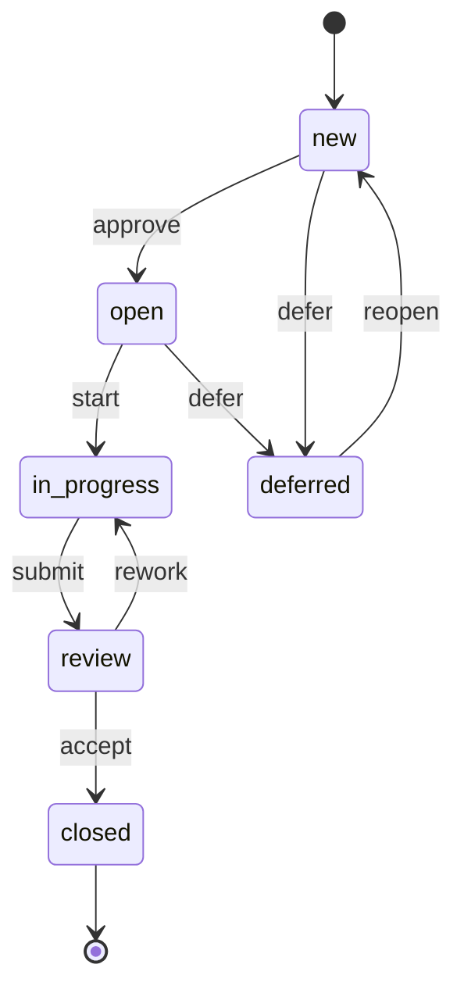
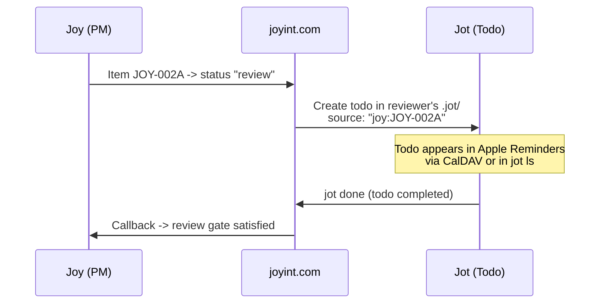

# Joy -- Vision

Joy is a terminal-native product management tool that lives inside your Git repository. It replaces heavyweight tools like Jira with a fast, file-based workflow that developers actually enjoy using.

Joy is built for teams of all sizes -- from solo founders with AI agent teams, through small development teams, to enterprises in regulated industries that need AI governance, audit trails, and compliance for AI-assisted development.

## Naming and Distribution

The user-facing command is `joy`. Packages are published as `joyint` (or `joyint-cli`) on crates.io, npm, and other registries to avoid naming collisions. The `.joy/` directory in repos and the `joy` binary name are the consistent brand touchpoints.

The portal and sync service run under **joyint.com**. Self-hosting is supported with a commercial license for server components.

## Core Principles

**Git-native.** All data lives in `.joy/` inside your repo. YAML files, versioned with Git, no external service required to start. Your product management history is part of your code history. Git is the sync backend -- your local `.joy/` directory is always yours, always readable, always complete.

**Terminal-first, not terminal-only.** The CLI is the primary interface. A TUI provides visual overview. A portal (joyint.com or self-hosted) enables access from any device -- browser, desktop app, mobile access via CalDAV -- plus collaboration and AI agent orchestration.

**Dogfooding.** Joy is built and managed with Joy. Every feature goes through Joy's own workflow before it's shipped.

**AI as a first-class collaborator.** AI agents don't just assist -- they estimate, plan, implement, and review. Joy orchestrates the handoff between human intent and AI execution.

**Simple by default, powerful when needed.** 10 core commands cover 95% of daily use. Complexity lives in flags and interactive mode, not in the command hierarchy.

---

## Target Audience

- Solo developers managing side projects with AI agents
- Small development teams (2-10) replacing Jira or Linear
- Enterprises in regulated industries needing AI governance, audit trails, and compliance

---

## Data Model

### Project

A Joy project is initialized in any directory (typically a Git repo root). It creates a `.joy/` directory with the following structure:

```
.joy/
├── config.yaml              # Project-level settings (committed)
├── credentials.yaml         # Project-level secrets (gitignored)
├── project.yaml             # Project metadata
├── items/
│   ├── JOY-0001-auth-system.yaml
│   ├── JOY-0002-login-page.yaml
│   └── ...
├── milestones/
│   ├── JOY-MS-01-beta-release.yaml
│   └── ...
├── ai/
│   ├── agents/              # Agent role definitions
│   └── jobs/                # Active and completed AI jobs
└── log/                     # Local change log (supplements git log)
```

Both `config.yaml` and `credentials.yaml` support two levels: global (`~/.config/joy/`) and project-local (`.joy/`). Project-local values override global defaults. This lets you set your API key once globally and override per project when needed.

### User Identity

A user's identity in Joy is their **e-mail address**. This is the stable identifier used in item fields (`assignee`, `author`), role definitions, change history, and sync authentication.

Locally, the e-mail is read from `git config user.email` -- no separate login required for CLI usage. On the server, users authenticate via OAuth (GitHub, GitLab, Gitea, or other supported providers). The server matches the OAuth-provided e-mail against the project's role definitions.

AI agents use a synthetic identity with the `agent:` prefix (e.g. `agent:implementer@joy`). This distinguishes agent actions from human actions in the change log and enables `allow_ai` rules in status transitions.

### Items

Everything is an **Item**. An Item has a `type` that determines its semantics, but the data structure is uniform. This keeps the CLI surface small and the mental model simple.

```yaml
# .joy/items/JOY-002A-payment-integration.yaml
id: JOY-002A
title: Payment Integration
type: story           # epic | story | task | bug | rework | decision | idea
status: new           # new | open | in-progress | review | closed | deferred
priority: high        # low | medium | high | critical
parent: JOY-0001       # parent item (null for top-level items)
assignee: null        # e-mail address or agent:role@joy
deps:
  - JOY-0017           # must be completed before this item
  - JOY-0026
milestone: JOY-MS-01    # optional milestone association
tags:
  - backend
  - payments
due_date: 2026-04-15                # optional due date
reminder: 2026-04-14T09:00:00Z      # optional reminder (used by Jot and CalDAV)
source: null                         # optional: dispatch source (e.g. "joy:PROJ-002A")
created: 2026-03-09T10:00:00Z
updated: 2026-03-09T10:00:00Z
description: |
  Integrate Stripe for payment processing.
  Must support EUR and USD.
comments:
  - author: orchidee@joyint.com
    date: 2026-03-09T10:30:00Z
    text: "Consider also supporting SEPA direct debit."
```

Items form a generic parent-child hierarchy via the `parent` field. Any item can be a parent -- epics group stories, stories group tasks, etc. All commands (`add`, `ls`, `status`, `rm`, etc.) work uniformly across any nesting depth.

### Item Types

| Type | Purpose |
|------|---------|
| `epic` | Large feature or initiative, groups other items |
| `story` | User-facing functionality |
| `task` | Technical work, not directly user-facing |
| `bug` | Defect to fix |
| `rework` | Refactoring or improvement of existing code |
| `decision` | Architectural or product decision to document |
| `idea` | Spontaneous idea, not yet refined into a concrete item |

### Milestones

```yaml
# .joy/milestones/JOY-MS-01-beta-release.yaml
id: JOY-MS-01
title: Beta Release
date: 2026-06-01
description: "First public beta with core features."
```

Items are linked to milestones via their `milestone` field. Milestones are inherited: if an item has no milestone but its parent does, the parent's milestone applies. This inheritance walks the full parent chain.

---

## Status Workflow

The default status flow:



`blocked` is not a manual state -- it is computed automatically from dependencies.

The status model is intentionally minimal -- most teams need 5-6 states, not 15.

### Status Rules

**One process with dimmers, not multiple processes with switches.** There is exactly one workflow per project. It is not templated, not selectable, not importable. Instead, individual transitions can be tightened or loosened via rules in `.joy/project.yaml`.

A solo founder uses Joy with zero rules -- every transition is open. A team adds a gate on `review -> closed` so only leads can accept work. A regulated project adds a second gate on `new -> open` for triage. Same workflow, different strictness. This scales from "no process" to "controlled process" without switching modes, importing templates, or learning a new concept.

Available gates:

- **new -> open** (triage gate): only approvers can move items into the backlog
- **review -> closed** (acceptance gate): only approvers can close items, optionally requiring green CI

Each gate supports `requires_role`, `requires_ci`, and `allow_ai`. By default all transitions are unrestricted. Gates are opt-in. AI agents can be excluded from gated transitions via `allow_ai: false`.

### Dependencies

Dependencies are modeled as a simple list of item IDs in the `deps` field. One direction only: "I need X before I can start Y."

**Automatic behaviors:**

- Starting an item with open deps triggers a warning (not a block)
- Closing an item notifies dependents that they are unblocked
- `joy ls --blocked` shows all items waiting on dependencies
- Cycle detection prevents circular dependencies

---

## CLI Commands

### Project

```sh
joy                                     # Board/overview -- the most used command
joy init                                # Initialize new project
  joy init --name "Joyint" --acronym JI

joy project                             # View/edit project info (interactive)
  joy project --name "Joyint Platform"

joy log                                 # Event log (audit trail)
  joy log --since 7d
  joy log --item JOY-002A
  joy log --limit 50                    # max entries (default: 20)

joy roadmap                             # Milestone roadmap (tree view)
  joy roadmap --all                    # include closed and deferred items

joy find [query]                        # Search items by text
  joy find "payment"                   # case-insensitive, matches title and description

joy board                               # Board overview (same as bare joy)
  joy board --all                      # show all items (no limit per group)
```

### Items

```sh
joy add <TYPE> <TITLE> [OPTIONS]         # Create new item
  joy add story "Login Page" --parent JOY-0001 --priority high
  joy add bug "Crash bei Umlauten" --version v0.5.0
  joy add epic "Auth System"

joy edit [id]                           # Edit item
  joy edit JOY-002A --title "Payment v2" --priority critical
  joy edit JOY-002A --version v0.5.0    # set version tag
  joy edit JOY-002A --version none      # remove version tag

joy rm [id]                             # Delete item (with confirmation)
  joy rm JOY-002A
  joy rm JOY-002A --force                # skip confirmation
  joy rm JOY-0001 --recursive             # item + all descendants
  joy rm -rf JOY-0001                     # same as --recursive --force

joy ls                                  # List and filter items
  joy ls                                # active items (excludes closed and deferred)
  joy ls --all                          # all items including closed and deferred
  joy ls --parent JOY-0001                # items of a parent (and descendants)
  joy ls --type bug                     # only bugs
  joy ls --status in-progress           # by status
  joy ls --blocked                      # items with open deps
  joy ls --priority critical            # by priority
  joy ls --mine                         # assigned to me
  joy ls --milestone JOY-MS-01              # by milestone (includes inherited)
  joy ls --tree                         # hierarchical tree view
  joy ls --tree --group milestone       # tree grouped by milestone
  joy ls --tag backend                  # by tag
  joy ls --version v0.5.0               # by version tag
  joy ls --show milestone,assignee      # extra columns (milestone, assignee, parent)

joy show [id]                           # Detail view
  joy show JOY-002A                      # all info, deps, history, comments
```

### Status

```sh
joy status [id] [state]                 # Change status
  joy status JOY-002A in-progress
  joy status JOY-002A closed             # warns if dependents still open
  joy status JOY-0001 closed              # warns if child items still open
  # Adding children to a closed parent triggers a warning

# Shortcuts for common transitions
joy start [id]                          # alias for: joy status [id] in-progress
joy submit [id]                         # alias for: joy status [id] review
joy close [id]                          # alias for: joy status [id] closed
joy reopen [id]                         # alias for: joy status [id] open
```

### Release

```sh
joy release                             # Show items for latest git tag
  joy release v0.5.0                    # Show items tagged with v0.5.0
```

Version tags link items to git releases. Use `--version` on `joy add` or `joy edit` to tag items. If no git tags exist, `joy release` without arguments shows a usage hint.

### Assignment

```sh
joy assign [id] [email]                 # Assign item to a person or agent
  joy assign JOY-002A orchidee@joyint.com
  joy assign JOY-002A --unassign         # remove assignment
```

### Comments

```sh
joy comment [id] [text]                 # Add a comment to an item
  joy comment JOY-002A "Looks good, ready to merge."
```

### Dependencies

```sh
joy deps [id]                           # Show dependencies
  joy deps JOY-002A                      # list
  joy deps JOY-002A --tree               # tree view
  joy deps JOY-002A --add JOY-0017        # add dependency
  joy deps JOY-002A --rm JOY-0017         # remove dependency
```

### Milestones

```sh
joy milestone add [name]                # Create milestone
  joy milestone add "Beta Release" --date 2026-06-01

joy milestone ls                        # List milestones

joy milestone rm [id]                   # Delete milestone
joy milestone show [id]                 # Detail: items, progress, risks

joy milestone link [item-id] [ms-id]    # Assign item to milestone
  joy milestone link JOY-002A JOY-MS-01

joy milestone unlink [item-id]          # Remove item from milestone

joy milestone edit [id]                 # Modify milestone
  joy milestone edit JOY-MS-01 --title "Beta" --date 2026-07-01
```

### Sync and Collaboration

```sh
joy sync                                # Bidirectional sync (default)
  joy sync --push                       # upload only
  joy sync --pull                       # download only
  joy sync --auto                       # background sync

joy clone [url]                         # Clone project from remote
  joy clone joyint.com/joydev/platform
```

### App and Server

```sh
joy app                                 # TUI (default)

joy serve                               # Start server (for remote sync + web UI)
  joy serve --config server.yaml
  joy serve --daemon                    # Run as background process
```

### Shell Completions and Help

```sh
joy completions [shell]                 # Generate shell completions
  joy completions bash
  joy completions zsh
  joy completions fish

joy tutorial                            # Read the tutorial in a pager
```

---

## AI Integration

Joy supports two modes of AI integration:

### Tool mode (MS-02): Joy as a tool for AI agents

External AI agents use Joy's CLI as a tool. The agent calls `joy` commands to read, create, and manage items. This already works today via skill definitions (e.g. the `/joy` Claude Code skill). `joy ai setup tool` formalizes this by generating the appropriate config files for the detected AI tool.

Supported tools for tool mode:

| Tool | Config ID | Integration |
|------|-----------|-------------|
| Claude Code (Anthropic) | `claude-code` | Skill file + CLAUDE.md |
| GitHub Copilot (GitHub) | `github-copilot` | `.github/copilot-instructions.md` |
| Mistral Vibe (Mistral) | `mistral-vibe` | Project instructions |
| Qwen Code (Alibaba) | `qwen-code` | Project instructions |

No own agent runtime, no API calls, no cost tracking needed. The AI tool handles everything -- Joy just provides the product management interface.

### Agent mode (MS-05): Joy dispatches to AI

Joy actively dispatches work to external AI tools and tracks results:

| Tool | Config ID | Command |
|------|-----------|---------|
| Claude Code (Anthropic) | `claude-code` | `claude` |
| Mistral Vibe (Mistral) | `mistral-vibe` | `vibe` |
| GitHub Copilot (GitHub) | `github-copilot` | `copilot` |
| Qwen Code (Alibaba) | `qwen-code` | `qwen` |

Each project configures one tool via `joy ai setup agent`. Joy is the **dispatcher**, not the **runtime** -- it prepares context, invokes the tool, and tracks the outcome.

**Workflows:**
- **Estimation:** AI estimates effort and cost from item context
- **Planning:** AI proposes epic breakdown into stories and tasks
- **Implementation:** AI generates code, Joy tracks the job
- **Review:** AI reviews implementation against acceptance criteria
- **Status Intelligence:** Joy suggests status updates from git activity

### AI Commands

```sh
joy ai setup tool                       # Generate config for external AI agent (MS-02)
joy ai setup agent [tool]               # Configure Joy as AI dispatcher (MS-05)
  joy ai setup agent claude-code
  joy ai setup agent mistral-vibe --model devstral-small

joy ai estimate [id]                    # Estimate effort and cost
  joy ai estimate JOY-002A
  joy ai estimate JOY-0001                # estimate all items in epic

joy ai plan [id]                        # Break epic into items
  joy ai plan JOY-0001

joy ai implement [id]                   # AI agent implements item
  joy ai implement JOY-002A
  joy ai implement JOY-002A --budget 5.00

joy ai review [id]                      # AI reviews implementation
  joy ai review JOY-002A

joy ai status                           # Show running AI jobs
  joy ai status --history               # include completed jobs
```

### Agent Configuration

```yaml
# .joy/config.yaml (ai section)
ai:
  mode: agent                  # tool | agent
  tool: claude-code            # claude-code | mistral-vibe | github-copilot | qwen-code
  command: claude              # CLI command to invoke
  model: auto                  # model name or "auto" (tool default)
  max_cost_per_job: 10.00
  currency: EUR
```

### Cost Tracking (agent mode)

Every AI job logs its cost:

```yaml
# .joy/ai/jobs/JOY-JOB-000F.yaml
id: JOY-JOB-000F
item: JOY-002A
type: implement
tool: claude-code
status: completed
started: 2026-03-09T14:00:00Z
completed: 2026-03-09T14:12:00Z
tokens_in: 45200
tokens_out: 12800
cost: 0.42
currency: EUR
result:
  branch: feat/JOY-002A-payment-integration
  commits: 3
  files_changed: 7
```

Aggregated cost views available via `joy ai status --costs` per item, epic, milestone, or time range.

---

## Dispatch: Bridging Joy and Jot

Joy and Jot use **separate item pools** (`.joy/` and `.jot/`), but the dispatch mechanism on joyint.com bridges them. When a Joy item reaches a status gate that requires human or AI action, joyint.com creates a corresponding Jot todo in the target user's repository.



- **Human dispatch:** Joy status gates create Jot todos for reviewers, testers, or approvers.
- **AI dispatch:** Joy creates Jot todos for AI agents (`agent:implementer@joy`). The agent picks up todos via `jot ls --mine`, executes work, and marks them done.
- **Callback:** When a dispatched Jot todo is completed, joyint.com signals back to the Joy project that the gate is satisfied.

This keeps Joy focused on orchestration and Jot focused on execution. The `source` field and the dispatch service on joyint.com are the only coupling points.

---

## Design Philosophy

**Fewer commands, more power.** 10 commands cover daily work. Power users compose with flags, pipes, and scripts.

**Warnings, not walls.** Joy informs about risks (open deps, unfinished items in milestone) but never blocks. The human decides.

**Text files are the API.** The `.joy/` directory is human-readable and machine-parseable. Any tool that can read YAML can integrate with Joy.

**AI is a team member, not a feature.** AI agents have roles, budgets, and accountability. Their work is tracked the same way as human work.

**Start solo, scale to team.** Joy works offline for one person. Add a server when you need collaboration. The workflow doesn't change -- only sync is added.

**One process, adjustable strictness.** Joy has one workflow, not a library of process templates. Strictness is controlled by adding or removing rules on individual transitions. Zero rules means zero ceremony. Two rules give you triage and acceptance gates. No mode switching, no template selection, no workflow engine.

---

## Bootstrapping: Building Joy with Joy

Joy is built using itself from the earliest possible moment.

### MS-01 -- Core CLI (complete, 2026-03)

The CLI is the foundation. All core commands are implemented and Joy manages its own backlog since v0.5.0:

- `joy init`, `joy add`, `joy ls`, `joy show`, `joy edit`, `joy rm`
- `joy status`, `joy start`, `joy submit`, `joy close`, `joy reopen`
- `joy assign`, `joy comment`, `joy deps`, `joy milestone`, `joy log`
- `joy roadmap`, `joy find`, `joy board`, `joy project`, `joy tutorial`
- Semantic ANSI colors, emoji indicators, compact table formatting
- Structured event log, shell completions

### MS-02 -- AI tool mode (2026-04)

Joy as a tool/skill for external AI agents:

- `joy ai setup tool` -- generate config files for external AI agents
- Standardized instructions that work across AI tools
- No own agent runtime -- the external tool calls `joy` commands

### MS-03 -- Sync and Server (2026-04)

- `joy serve` -- HTTP server (REST API, Git gateway, CalDAV)
- `joy sync` -- push/pull via Git remote
- `joy clone` -- clone remote project
- OAuth authentication (GitHub, GitLab, Gitea)
- E2E encryption (AES-256-GCM, always active on joyint.com)

### MS-04 -- Web UI and Portal (2026-05)

- SolidJS web frontend (board, item management, roadmap) for Joy and Jot
- CalDAV server for Jot (VTODO bridge to Apple Reminders, Google Calendar)
- Notification service (due dates, status changes, mentions)
- joyint.com deployment (managed hosting)
- Tauri native app (desktop and mobile)

### MS-05 -- AI agent mode (2026-06)

Joy dispatches work to AI APIs and tracks results:

- `joy ai setup agent` -- configure AI tool and model
- `joy ai estimate`, `joy ai plan`, `joy ai implement`, `joy ai review`
- Job logging and cost tracking

### MS-06 -- TUI (2026-07)

- `joy app` -- ratatui-based terminal UI
- Board view, item detail panel, dependency graph

### MS-07 -- Initial JOYC Integration (2026-08)

- First minimal integration of the IOTA-based AI settlement layer
- Cost settlement on-chain for AI jobs

---

## Related

For business context (pricing, licensing, competitive landscape) see [BusinessModel.md](https://github.com/joyint/project/blob/main/docs/BusinessModel.md) and [Competition.md](https://github.com/joyint/project/blob/main/docs/Competition.md) in the umbrella repository. These documents are part of the internal planning for the Joyint product ecosystem at Joydev GmbH.
