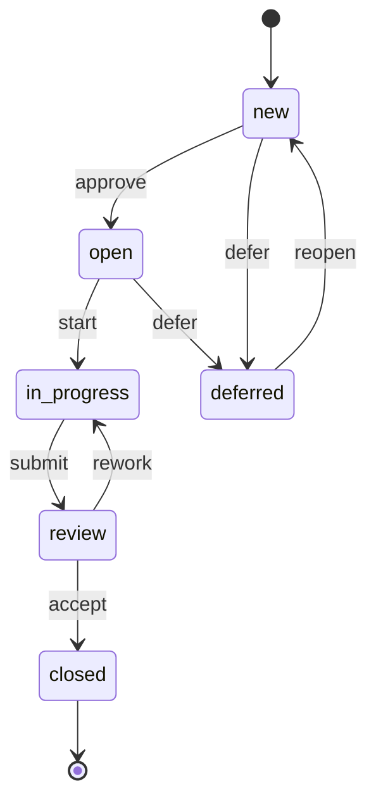

# Joy — Product Management for Developers

## Vision

Joy is a terminal-native product management tool that lives inside your Git repository. It replaces heavyweight tools like Jira with a fast, file-based workflow that developers actually enjoy using.

Joy is built for small, ambitious teams — and for solo founders who use AI agents as their development team.

## Naming & Distribution

The user-facing command is `joy`. Packages are published as `joyint` (or `joyint-cli`) on crates.io, npm, and other registries to avoid naming collisions. The `.joy/` directory in repos and the `joy` binary name are the consistent brand touchpoints.

The portal and sync service run under **joyint.com**. Self-hosting is fully supported.

## Core Principles

**Git-native.** All data lives in `.joy/` inside your repo. YAML files, versioned with Git, no external service required to start. Your product management history is part of your code history. When you sync, the portal acts as the conflict resolver (see [ADR-004](./Architecture.md#architecture-decision-records-adrs)) -- but your local `.joy/` directory is always yours, always readable, always complete.

**Terminal-first, not terminal-only.** The CLI is the primary interface. A TUI provides visual overview. A portal (joyint.com or self-hosted) enables access from any device — browser, desktop app, mobile app — plus collaboration and AI agent orchestration.

**Dogfooding.** Joy is built and managed with Joy. Every feature goes through Joy's own workflow before it's shipped.

**AI as a first-class collaborator.** AI agents don't just assist — they estimate, plan, implement, and review. Joy orchestrates the handoff between human intent and AI execution.

**Simple by default, powerful when needed.** 10 core commands cover 95% of daily use. Complexity lives in flags and interactive mode, not in the command hierarchy.

---

## Data Model

### Project

A Joy project is initialized in any directory (typically a Git repo root). It creates a `.joy/` directory with the following structure:

```
.joy/
├── config.yaml              # Project-level settings (committed)
├── credentials.yaml         # Project-level secrets (gitignored)
├── project.yaml             # Project metadata
├── items/
│   ├── EP-0001-auth-system.yaml
│   ├── IT-0001-login-page.yaml
│   ├── IT-0002-umlaut-crash.yaml
│   └── ...
├── milestones/
│   ├── MS-01-beta-release.yaml
│   └── ...
├── ai/
│   ├── agents/              # Agent role definitions
│   └── jobs/                # Active and completed AI jobs
└── log/                     # Local change log (supplements git log)
```

Both `config.yaml` and `credentials.yaml` support two levels: global (`~/.config/joy/`) and project-local (`.joy/`). Project-local values override global defaults. This lets you set your API key once globally and override per project when needed.

### User Identity

A user's identity in Joy is their **e-mail address**. This is the stable identifier used in item fields (`assignee`, `author`), role definitions, change history, and sync authentication.

Locally, the e-mail is read from `git config user.email` -- no separate login required for CLI usage. On the server, users authenticate via OAuth (GitHub, Gitea, or other supported providers). The server matches the OAuth-provided e-mail against the project's role definitions.

AI agents use a synthetic identity with the `agent:` prefix (e.g. `agent:implementer@joy`). This distinguishes agent actions from human actions in the change log and enables `allow_ai` rules in status transitions.

### Items

Everything is an **Item**. An Item has a `type` that determines its semantics, but the data structure is uniform. This keeps the CLI surface small and the mental model simple.

```yaml
# .joy/items/IT-002A-payment-integration.yaml
id: IT-002A
title: Payment Integration
type: story           # epic | story | task | bug | rework | decision
status: new           # new | open | in-progress | review | closed | deferred
priority: high        # low | medium | high | critical
epic: EP-0001         # parent epic (null for epics themselves)
assignee: null        # e-mail address or agent:role@joy
deps:
  - IT-0017           # must be completed before this item
  - IT-0026
milestone: MS-01    # optional milestone association
tags:
  - backend
  - payments
created: 2026-03-09T10:00:00Z
updated: 2026-03-09T10:00:00Z
description: |
  Integrate Stripe for payment processing.
  Must support EUR and USD.
comments:
  - author: orchidee@joyint.com
    date: 2026-03-09T10:30:00Z
    text: "Consider also supporting SEPA direct debit."
```

**Type semantics:**

| Type | Purpose |
|------|---------|
| `epic` | Large feature or initiative, groups other items |
| `story` | User-facing functionality |
| `task` | Technical work, not directly user-facing |
| `bug` | Defect to fix |
| `rework` | Refactoring or improvement of existing code |
| `decision` | Architectural or product decision to document |

Epics are items too — they just have `type: epic` and no `epic:` parent field. This means all commands (`add`, `ls`, `status`, `rm`, etc.) work uniformly.

### Milestones

```yaml
# .joy/milestones/MS-01-beta-release.yaml
id: MS-01
title: Beta Release
date: 2026-06-01
description: "First public beta with core features."
```

Items are linked to milestones via their `milestone` field.

### Status Workflow

The default status flow:



`blocked` is not a manual state — it is computed automatically from dependencies.

The status model is intentionally minimal — most teams need 5-6 states, not 15.

### Status Rules

**One process with dimmers, not multiple processes with switches.** There is exactly one workflow per project. It is not templated, not selectable, not importable. Instead, individual transitions can be tightened or loosened via rules in `.joy/project.yaml` (see [Architecture.md](./Architecture.md#project-roles-and-status-rules-joyprojectyaml)).

A solo founder uses Joy with zero rules — every transition is open. A team adds a gate on `review -> closed` so only leads can accept work. A regulated project adds a second gate on `new -> open` for triage. Same workflow, different strictness. This scales from "no process" to "controlled process" without switching modes, importing templates, or learning a new concept.

Available gates:

- **new -> open** (triage gate): only approvers can move items into the backlog
- **review -> closed** (acceptance gate): only approvers can close items, optionally requiring green CI

Each gate supports `requires_role`, `requires_ci`, and `allow_ai`. By default all transitions are unrestricted. Gates are opt-in. AI agents can be excluded from gated transitions via `allow_ai: false`.

### Dependencies

Dependencies are modeled as a simple list of item IDs in the `deps` field. One direction only: "I need X before I can start Y."

**Automatic behaviors:**

- Starting an item with open deps triggers a warning (not a block)
- Closing an item notifies dependents that they are unblocked
- `joy ls --blocked` shows all items waiting on dependencies
- Cycle detection prevents circular dependencies

---

## CLI Commands

### Project

```sh
joy                                     # Board/overview — the most used command
joy init                                # Initialize new project
  joy init --name "Joyint" --acronym JI

joy project                             # View/edit project info (interactive)
  joy project --name "Joyint Platform"

joy log                                 # Chronological change history
  joy log --since 7d
  joy log --item IT-002A
```

### Items

```sh
joy add [title]                         # Create new item
  joy add "Login Page" --type story --epic EP-0001 --priority high
  joy add "Crash bei Umlauten" --type bug
  joy add "Auth System" --type epic
  joy add                               # interactive mode (default)

joy edit [id]                           # Edit item
  joy edit IT-002A --title "Payment v2" --priority critical
  joy edit IT-002A                      # interactive

joy rm [id]                             # Delete item (with confirmation)
  joy rm IT-002A
  joy rm IT-002A --force                # skip confirmation
  joy rm EP-0001 --cascade               # epic + all linked items

joy ls                                  # List and filter items
  joy ls                                # all active items (excludes closed and deferred)
  joy ls --epic EP-0001                  # items of an epic
  joy ls --type bug                     # only bugs
  joy ls --status in-progress           # by status
  joy ls --blocked                      # items with open deps
  joy ls --blocking                     # items blocking others
  joy ls --priority critical            # by priority
  joy ls --mine                         # assigned to me
  joy ls --tree                         # hierarchical view

joy show [id]                           # Detail view
  joy show IT-002A                      # all info, deps, history, comments
```

### Status

```sh
joy status [id] [state]                 # Change status
  joy status IT-002A in-progress
  joy status IT-002A closed             # warns if dependents still open
  joy status EP-0001 closed              # warns if child items still open

# Shortcuts for common transitions
joy start [id]                          # alias for: joy status [id] in-progress
joy submit [id]                         # alias for: joy status [id] review
joy close [id]                          # alias for: joy status [id] closed
```

### Assignment

```sh
joy assign [id] [email]                 # Assign item to a person or agent
  joy assign IT-002A orchidee@joyint.com
  joy assign IT-002A --unassign         # remove assignment
```

### Comments

```sh
joy comment [id] [text]                 # Add a comment to an item
  joy comment IT-002A "Looks good, ready to merge."
  joy comment IT-002A                   # interactive (opens $EDITOR)
```

### Dependencies

```sh
joy deps [id]                           # Show dependencies
  joy deps IT-002A                      # list
  joy deps IT-002A --tree               # tree view
  joy deps IT-002A --add IT-0017        # add dependency
  joy deps IT-002A --rm IT-0017         # remove dependency
```

### Milestones

```sh
joy milestone add [name]                # Create milestone
  joy milestone add "Beta Release" --date 2026-06-01

joy milestone ls                        # List milestones
  joy milestone ls --upcoming

joy milestone rm [id]                   # Delete milestone
joy milestone show [id]                 # Detail: items, progress, risks

joy milestone link [item-id] [ms-id]    # Assign item to milestone
  joy milestone link IT-002A MS-01
```

### Sync & Collaboration

```sh
joy sync                                # Bidirectional sync (default)
  joy sync --push                       # upload only
  joy sync --pull                       # download only
  joy sync --auto                       # background sync

joy clone [url]                         # Clone project from remote
  joy clone joyint.com/joydev/platform
```

### AI

```sh
joy ai setup [tool]                     # Configure AI tool and model
  joy ai setup claude-code
  joy ai setup mistral-vibe --model devstral-small

joy ai estimate [id]                    # Estimate effort and cost
  joy ai estimate IT-002A
  joy ai estimate EP-0001                # estimate all items in epic

joy ai plan [id]                        # Break epic into items
  joy ai plan EP-0001

joy ai implement [id]                   # AI agent implements item
  joy ai implement IT-002A
  joy ai implement IT-002A --budget 5.00

joy ai review [id]                      # AI reviews implementation
  joy ai review IT-002A

joy ai status                           # Show running AI jobs
  joy ai status --history               # include completed jobs
```

### App & Server

```sh
joy app                                 # TUI (default)

joy serve                               # Start server (for remote sync + web UI)
  joy serve --config server.yaml
  joy serve --daemon                    # Run as background process
```

### Shell Completions

```sh
joy completions [shell]                 # Generate shell completions
  joy completions bash
  joy completions zsh
  joy completions fish
```

---

## AI Integration

### Supported AI Tools

Joy does not implement its own agent runtime. Instead, it dispatches work to external CLI-based AI tools and tracks the results. Each tool requires an adapter in `joy-ai` that handles context preparation, invocation, and output parsing. The adapter interface is kept minimal to limit coupling to specific CLI conventions.

| Tool | Config ID | Command | Priority |
|------|-----------|---------|----------|
| Claude Code (Anthropic) | `claude-code` | `claude` | P0 |
| Mistral Vibe (Mistral) | `mistral-vibe` | `vibe` | P0 |
| GitHub Copilot (GitHub) | `github-copilot` | `copilot` | P1 |
| Qwen Code (Alibaba) | `qwen-code` | `qwen` | P1 |

Each project configures exactly one tool via `joy ai setup`. The tool can be set with a specific model or `auto` (tool's default). Joy is the **dispatcher**, not the **runtime** -- it prepares context (item description, relevant files, branch name), invokes the configured tool, and tracks the outcome (branch, commits, cost).

### AI Workflows

**Estimation:** Joy sends the item description, codebase context, and dependencies to the configured AI tool. The response estimates effort in hours and cost in currency.

**Planning:** Given an epic description, Joy sends context to the AI tool and receives a proposed breakdown into stories, tasks, and dependencies. Human reviews and approves via `joy add` with the proposed items.

**Implementation:** Joy prepares the context (item YAML, relevant code paths, branch name), invokes the configured AI tool (e.g. `claude`, `vibe`), and monitors the result. Joy tracks the job, its status, and its cost. The tool handles the actual code generation, branching, and committing.

**Review:** Joy sends an implementation diff and the item's acceptance criteria to the AI tool. The response is a structured review with pass/fail and comments.

**Status Intelligence:** Joy analyzes git log, branch activity, and code changes to suggest status updates. "IT-002A has 15 commits on branch `feat/payment` -- suggest moving to `review`?"

### Agent Configuration

Each project uses one AI tool, configured with a fixed model or `auto` (tool picks its default). There is no separate LLM config -- the tool handles model selection.

```yaml
# .joy/config.yaml (ai section)
ai:
  tool: claude-code            # claude-code | mistral-vibe | github-copilot | qwen-code
  command: claude              # CLI command to invoke
  model: auto                  # model name or "auto" (tool default)
  max_cost_per_job: 10.00
  currency: EUR
```

API keys are stored separately in `credentials.yaml` (see [Architecture.md](./Architecture.md#credentials)):

```yaml
# .joy/credentials.yaml or ~/.config/joy/credentials.yaml
ai:
  api_key: sk-ant-...
```

`joy ai setup` detects installed tools, lets the user pick one, and writes the tool config to `config.yaml` and the API key to `credentials.yaml`. Switching tools is a single `joy ai setup` call.

### Cost Tracking

Every AI job logs its cost:

```yaml
# .joy/ai/jobs/JOB-000F.yaml
id: JOB-000F
item: IT-002A
type: implement
tool: claude-code
status: completed
started: 2026-03-09T14:00:00Z
completed: 2026-03-09T14:12:00Z
tokens_in: 45200
tokens_out: 12800
cost: 0.42
currency: EUR
result:
  branch: feat/IT-002A-payment-integration
  commits: 3
  files_changed: 7
```

Aggregated cost views available via `joy ai status --costs` per item, epic, milestone, or time range.

---

## Sync & Portal

### Sync Model

Joy uses a **portal-as-source-of-truth** model for sync. The portal (joyint.com or self-hosted) maintains the canonical state. CLI instances push and pull changes.

This is deliberately *not* distributed like Git. Product management data (status changes, assignments, priorities) does not merge well. Last-write-wins with conflict detection is simpler and more predictable than three-way merge.

**v1:** Sync operates over HTTPS without content encryption. Projects should use private repositories and authenticated server connections. **v2** will add client-side end-to-end encryption (AES-256-GCM) for item content before transmission, with cleartext metadata for server-side dashboards. See [ADR-006](./adr/ADR-006-client-side-encryption.md) for the planned design.

### Portal & App

`joy serve` starts the API server and serves the web UI. Self-hosting gives you the full experience -- same codebase, same features.

1. **Web UI** — Board, roadmap, dependency graph, item management. Served by `joy serve`, built with SolidJS. Fully open source (MIT).
2. **Sync Hub** — Central server for multi-device and multi-user sync. End-to-end encryption planned for v2.
3. **AI Command Center** — Dispatch AI jobs from anywhere. Monitor agent progress. Review and approve AI work.
4. **Native App** — Desktop (macOS, Linux, Windows) and mobile (iOS, Android) via Tauri. Shares the web frontend, adds offline support, OS integration, push notifications. Commercially licensed.

### joyint.com

The hosted portal at joyint.com is the managed service. It runs the same open-source code but adds operational value: hosting, uptime, backups, scaling, support SLAs, and managed AI quota. Joy is a complete, honestly open product. joyint.com sells convenience, not artificially locked features.

---

## Bootstrapping: Building Joy with Joy

Joy is built using itself from the earliest possible moment.

### Phase 0 — Minimal Viable Joy (Week 1-2)

Implement the absolute minimum to manage Joy's own development:

1. `joy init` — create `.joy/` structure
2. `joy add` — create items (interactive)
3. `joy ls` — list items
4. `joy status` — change status
5. `joy` — basic overview

At this point, Joy manages its own backlog. Every subsequent feature is an item in Joy.

### Phase 1 — Core CLI (Week 3-6)

- `joy edit`, `joy rm`, `joy show`
- `joy assign`, `joy comment`
- `joy start`, `joy submit`, `joy close` (status shortcuts)
- `joy deps` — dependency management
- `joy milestone` — milestone management
- `joy log` — change history
- Filtering and tree views for `joy ls`

### Phase 2a — AI Estimation & Review (Week 7-9)

- `joy ai setup` — tool and model configuration
- `joy ai estimate` — effort and cost estimation
- `joy ai review` — automated code review

### Phase 2b — AI Planning & Implementation (Week 10-13)

- `joy ai plan` — epic breakdown
- `joy ai implement` — dispatch to configured AI tool (Claude Code, Mistral Vibe)
- Cost tracking and job logging

### Phase 3 — TUI, Web UI & Sync (Week 14-19)

- `joy app` — ratatui-based TUI with board view
- `joy serve` — HTTP server with REST API and embedded web UI
- SolidJS web frontend (board, item management, roadmap)
- `joy sync` — push/pull to server (HTTPS, no encryption in v1)
- `joy clone` — clone remote project

### Phase 4 — Native App & Portal (Week 20-24)

- Tauri shell wrapping the web frontend for desktop and mobile
- Offline support, OS integration, push notifications
- joyint.com deployment (managed hosting)

---

## Design Philosophy

**Fewer commands, more power.** 10 commands cover daily work. Power users compose with flags, pipes, and scripts.

**Warnings, not walls.** Joy informs about risks (open deps, unfinished items in milestone) but never blocks. The human decides.

**Text files are the API.** The `.joy/` directory is human-readable and machine-parseable. Any tool that can read YAML can integrate with Joy.

**AI is a team member, not a feature.** AI agents have roles, budgets, and accountability. Their work is tracked the same way as human work.

**Start solo, scale to team.** Joy works offline for one person. Add a server when you need collaboration. The workflow doesn't change — only sync is added.

**One process, adjustable strictness.** Joy has one workflow, not a library of process templates. Strictness is controlled by adding or removing rules on individual transitions. Zero rules means zero ceremony. Two rules give you triage and acceptance gates. No mode switching, no template selection, no workflow engine.
