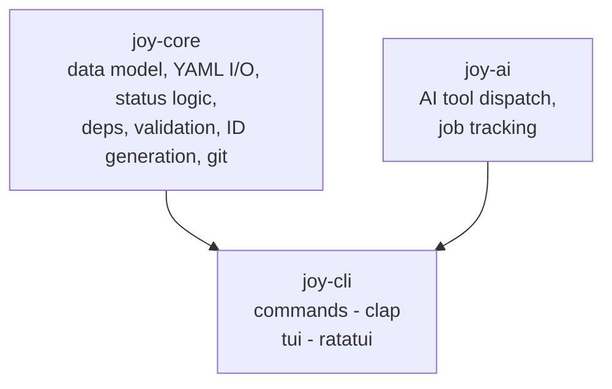

# Joy -- Architecture

This document defines the technical foundation for the Joy repository. It covers technology choices, repository structure, crate layout, and build configuration.

For product vision, data model, and CLI design see [Vision.md](./Vision.md). For coding conventions, testing, and CI/CD see [CONTRIBUTING.md](../../CONTRIBUTING.md). For cross-project architecture and ADRs see the [umbrella repository](https://github.com/joyint/project).

---

## Technology Stack

### Versioning Policy

Pin all dependencies to their current stable **major.minor** version. Track stable minor releases and update promptly (within 1 week of release). Major version upgrades are evaluated as ADRs.

### Core (CLI + TUI)

| Component                    | Version              | Rationale                                                         |
| ---------------------------- | -------------------- | ----------------------------------------------------------------- |
| **Rust**                     | 1.85 (latest stable) | Performance, single binary, type safety, memory safety            |
| **clap** (derive API)        | 4.5                  | De-facto CLI standard, shell completions, derive macros           |
| **ratatui**                  | 0.29                 | TUI framework, ships in same binary as CLI                        |
| **serde** + **serde_yml**    | 1.0 / 0.0.12         | YAML for `.joy/` files, JSON for API. 0.0.x is the current stable fork of the deprecated `serde_yaml` -- re-evaluate if a breaking change occurs |
| **tokio**                    | 1.43                 | Async runtime for server, sync, AI jobs                           |
| **thiserror**                | 2.0                  | Explicit error types in library crates                            |
| **anyhow**                   | 1.0                  | Convenient error handling in binary crate                         |
| **clap_complete**            | 4.5                  | Shell completion generation (bash, zsh, fish, PowerShell, elvish) |
| **console** / **owo-colors** | latest               | Terminal colors and styling                                       |
| **insta**                    | 1.41                 | Snapshot testing                                                  |

---

## Shared Logic: joy-core

The `joy-core` library crate is the shared foundation for both Joy and [Jyn](https://github.com/joyint/jyn). It provides the base data model (Item), YAML I/O, status logic, dependency management, and Git integration.

The Jyn repository depends on `joy-core` as an external crate dependency. `jyn-core` extends `joy-core::Item` with todo-specific features (recurring tasks, RRULE). This ensures consistent behavior across both tools while keeping Joy free of Jyn-specific code.



`joy-ai` is a library crate used by `joy-cli` (and by the Tauri app in `joyint/app`).

Note: There is no separate server binary. `joy serve` is a subcommand of the `joy` CLI binary. It serves the REST API (Git gateway), CalDAV, and the web UI. Server components are compiled behind the `server` feature flag to keep the default binary lean.

Multiple CLI instances can run simultaneously -- each reads/writes individual YAML files. File-level locking in `joy-core` prevents concurrent writes to the same item. The server serializes writes when running.

---

## Repository Structure

```
joy/
├── Cargo.toml                  # Workspace root
├── Cargo.lock
├── LICENSE                     # MIT license
├── CONTRIBUTING.md             # Coding conventions, testing, CI/CD
├── README.md
├── docs/
│   └── dev/
│       ├── Vision.md           # Product vision, data model, CLI design
│       └── Architecture.md     # This file
├── crates/
│   ├── joy-core/               # Shared library: data model, YAML I/O, logic (MIT)
│   │   ├── Cargo.toml
│   │   └── src/
│   │       ├── lib.rs
│   │       ├── model/          # Item, Milestone, Project structs
│   │       ├── store.rs        # YAML file read/write, project root detection
│   │       ├── items.rs        # Item CRUD, ID generation, dependency cycle detection
│   │       ├── milestones.rs   # Milestone CRUD, ID generation
│   │       ├── init.rs         # Project initialization
│   │       └── error.rs        # Error types (thiserror)
│   ├── joy-cli/                # PM CLI binary (clap) -- includes TUI and server (MIT)
│   │   ├── Cargo.toml
│   │   └── src/
│   │       ├── main.rs
│   │       ├── commands/       # One module per command (add, ls, status, rm, deps, ...)
│   │       ├── color.rs        # Semantic terminal colors
│   │       ├── tui/            # ratatui views (behind feature flag, planned)
│   │       └── server/         # axum server, CalDAV, notifications (behind feature flag)
│   └── joy-ai/                 # AI tool dispatch, job tracking (MIT)
│       ├── Cargo.toml
│       └── src/
├── tests/                      # Integration and E2E tests
│   ├── cli/                    # CLI integration tests
│   └── fixtures/               # Test data (.joy/ directories)
├── .github/
│   └── workflows/              # CI/CD
├── .claude/                    # Claude Code context
│   └── CLAUDE.md
└── justfile                    # Task runner (just)
```

---

## Cargo Workspace

```toml
# Cargo.toml (workspace root)
[workspace]
resolver = "2"
members = [
    "crates/joy-core",
    "crates/joy-cli",
    "crates/joy-ai",
]

[workspace.dependencies]
serde = { version = "1.0", features = ["derive"] }
serde_yml = "0.0.12"
serde_json = "1.0"
tokio = { version = "1.43", features = ["full"] }
thiserror = "2.0"
anyhow = "1.0"
clap = { version = "4.5", features = ["derive"] }
```

Feature flags in `joy-cli/Cargo.toml`:

```toml
[features]
default = ["tui"]
tui = ["dep:ratatui", "dep:crossterm"]
server = ["dep:axum", "dep:tower-http"]
full = ["tui", "server"]
```

---

## Licensing

Joy crates (`joy-core`, `joy-cli`, `joy-ai`) are MIT-licensed. Server components (REST API, CalDAV, notifications) compiled behind the `server` feature flag are commercially licensed by Joydev GmbH. See [ADR-008](https://github.com/joyint/project/blob/main/docs/dev/adr/ADR-008-open-core-licensing.md) for rationale.

---

## Security

### Credentials

Secrets (API keys, OAuth tokens) are stored in `credentials.yaml`. Configuration (settings, AI tool config, output preferences) is stored in `config.yaml`. Both support two levels:

| File | Global (`~/.config/joy/`) | Project (`.joy/`) |
| ---- | ------------------- | ----------------- |
| `config.yaml` | User defaults | Project-specific, committed to Git |
| `credentials.yaml` | User defaults | Project-specific, gitignored |

Project-local values override global defaults. File permissions for `credentials.yaml` are 0600.

### End-to-End Encryption

All data on joyint.com is E2E-encrypted (AES-256-GCM). The key stays on the client device. Server stores only encrypted blobs plus cleartext metadata (id, status, priority, due_date, timestamps) needed for notifications and CalDAV scheduling. See [ADR-006](https://github.com/joyint/project/blob/main/docs/dev/adr/ADR-006-client-side-encryption.md) for design details.

### AI Governance: The Five Pillars

Joy's AI Governance is an architecture built on five pillars: **Trustship** (who do I trust?), **Guardianship** (what do I protect against?), **Orchestration** (how do I steer work?), **Traceability** (what happened?), and **Settlement** (what did it cost?). Together they form the **Trust Model** -- see [Vision.md](./Vision.md#ai-governance-the-five-pillars) for the full breakdown.

### Agent Sandboxing

AI agents executing code operate in controlled environments (Guardianship pillar). Joy tracks what each agent is allowed to do (create branch, commit, push) -- no implicit permissions.

---

## Configuration Reference

### Config (`~/.config/joy/config.yaml` and `.joy/config.yaml`)

```yaml
# .joy/config.yaml (project-local, committed)
version: 1 # Config schema version

sync:
  remote: https://joyint.com/joydev/platform
  auto: false

output:
  color: auto # auto | always | never
  emoji: true # true | false

ai:
  tool: claude-code            # claude-code | mistral-vibe | github-copilot | qwen-code
  command: claude              # CLI command to invoke
  model: auto                  # model name or "auto" (tool default)
  max_cost_per_job: 10.00
  currency: EUR
```

### Project Roles and Status Rules (`.joy/project.yaml`)

```yaml
# .joy/project.yaml
roles:
  approver: [horst@joydev.com, anna@joydev.com]

status_rules:
  new -> open:
    requires_role: approver   # only approvers can move items into the backlog
    allow_ai: false           # AI agents cannot triage items
  review -> closed:
    requires_role: approver   # only approvers can accept items
    requires_ci: true         # branch CI must be green
    allow_ai: false           # AI agents cannot close items
```

Role members are identified by e-mail address, matching `git config user.email` locally and the OAuth-provided e-mail on the server.

IDs are not stored in config. The next available ID is derived at runtime by scanning existing filenames and incrementing the highest found value. IDs use the project acronym as prefix: ACRONYM-0001 to ACRONYM-FFFF for items, ACRONYM-MS-01 to ACRONYM-MS-FF for milestones.

---

## Architecture Decision Records

ADRs are maintained in the [umbrella repository](https://github.com/joyint/project/tree/main/docs/dev/adr). Key ADRs relevant to Joy:

- [ADR-001: YAML over SQLite for data storage](https://github.com/joyint/project/blob/main/docs/dev/adr/ADR-001-yaml-over-sqlite.md)
- [ADR-002: Single binary with feature flags](https://github.com/joyint/project/blob/main/docs/dev/adr/ADR-002-single-binary.md)
- [ADR-005: Package name `joyint`, binary name `joy`](https://github.com/joyint/project/blob/main/docs/dev/adr/ADR-005-package-name-joyint.md)
- [ADR-008: Open Core Licensing Model](https://github.com/joyint/project/blob/main/docs/dev/adr/ADR-008-open-core-licensing.md)
- [ADR-010: VCS abstraction layer](https://github.com/joyint/project/blob/main/docs/dev/adr/ADR-010-vcs-abstraction.md)
- [ADR-014: .joy/ directory versioning policy](https://github.com/joyint/project/blob/main/docs/dev/adr/ADR-014-joy-directory-versioning-policy.md)

---

## Performance Targets

- `joy` (overview): <100ms on a project with 100 items
- `joy ls`: <50ms for unfiltered list
- `joy add`: <200ms including file write and git staging
- `joy sync`: <2s for incremental sync of 10 changed items
- Binary size: <10MB for CLI+TUI, <20MB with server feature
- App startup: <1s to interactive on desktop
