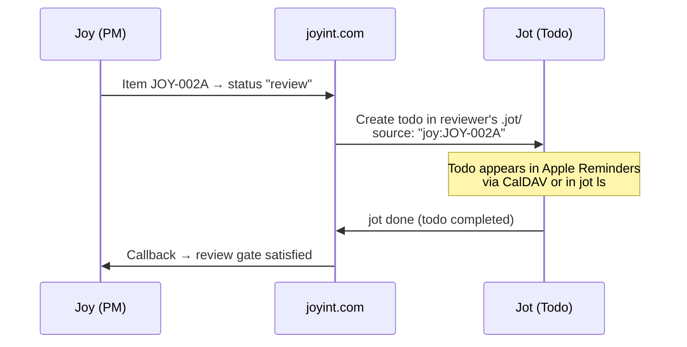

# Joy Platform — Vision

## Overview

Joy is a terminal-native product management tool that lives inside your Git repository. It replaces heavyweight tools like Jira with a fast, file-based workflow that developers actually enjoy using.

Joy is built for teams of all sizes -- from solo founders with AI agent teams, through small development teams, to enterprises in regulated industries that need AI governance, audit trails, and compliance for AI-assisted development.

Joy shares its core data model (`joy-core`) with **Jot**, a personal todo tool. Jot extends the base Item with recurring tasks, due dates, and reminders. Both tools use the same YAML format, the same Git-based sync, and the same platform (joyint.com).

See the product-specific vision documents for details:

- [joy.md](./joy.md) -- Joy: product management CLI, AI integration, milestones
- [jot.md](./jot.md) -- Jot: personal todo CLI, recurring tasks, CalDAV
- [joyint-com.md](./joyint-com.md) -- joyint.com: sync platform, E2E encryption, CalDAV, WebUI

## Naming & Distribution

The user-facing command is `joy`. Packages are published as `joyint` (or `joyint-cli`) on crates.io, npm, and other registries to avoid naming collisions. The `.joy/` directory in repos and the `joy` binary name are the consistent brand touchpoints.

The portal and sync service run under **joyint.com**. Self-hosting is supported with a commercial license for server components (see [ADR-008](../adr/ADR-008-open-core-licensing.md)).

## Core Principles

**Git-native.** All data lives in `.joy/` inside your repo. YAML files, versioned with Git, no external service required to start. Your product management history is part of your code history. Git is the sync backend (see [ADR-004](../adr/ADR-004-portal-source-of-truth.md)) -- your local `.joy/` directory is always yours, always readable, always complete.

**Terminal-first, not terminal-only.** The CLI is the primary interface. A TUI provides visual overview. A portal (joyint.com or self-hosted) enables access from any device -- browser, desktop app, mobile access via CalDAV -- plus collaboration and AI agent orchestration.

**Dogfooding.** Joy is built and managed with Joy. Every feature goes through Joy's own workflow before it's shipped.

**AI as a first-class collaborator.** AI agents don't just assist — they estimate, plan, implement, and review. Joy orchestrates the handoff between human intent and AI execution.

**Simple by default, powerful when needed.** 10 core commands cover 95% of daily use. Complexity lives in flags and interactive mode, not in the command hierarchy.

---

## Shared Data Model

### Project

A Joy project is initialized in any directory (typically a Git repo root). It creates a `.joy/` directory with the following structure:

```
.joy/
├── config.yaml              # Project-level settings (committed)
├── credentials.yaml         # Project-level secrets (gitignored)
├── project.yaml             # Project metadata
├── items/
│   ├── JOY-0001-auth-system.yaml
│   ├── JOY-0002-login-page.yaml
│   ├── JOY-0003-umlaut-crash.yaml
│   └── ...
├── milestones/
│   ├── JOY-MS-01-beta-release.yaml
│   └── ...
├── ai/
│   ├── agents/              # Agent role definitions
│   └── jobs/                # Active and completed AI jobs
└── log/                     # Local change log (supplements git log)
```

Both `config.yaml` and `credentials.yaml` support two levels: global (`~/.config/joy/`) and project-local (`.joy/`). Project-local values override global defaults. This lets you set your API key once globally and override per project when needed.

### User Identity

A user's identity in Joy is their **e-mail address**. This is the stable identifier used in item fields (`assignee`, `author`), role definitions, change history, and sync authentication.

Locally, the e-mail is read from `git config user.email` -- no separate login required for CLI usage. On the server, users authenticate via OAuth (GitHub, Gitea, or other supported providers). The server matches the OAuth-provided e-mail against the project's role definitions.

AI agents use a synthetic identity with the `agent:` prefix (e.g. `agent:implementer@joy`). This distinguishes agent actions from human actions in the change log and enables `allow_ai` rules in status transitions.

### Items

Everything is an **Item**. An Item has a `type` that determines its semantics, but the data structure is uniform. This keeps the CLI surface small and the mental model simple.

```yaml
# .joy/items/JOY-002A-payment-integration.yaml
id: JOY-002A
title: Payment Integration
type: story           # epic | story | task | bug | rework | decision | idea
status: new           # new | open | in-progress | review | closed | deferred
priority: high        # low | medium | high | critical
parent: JOY-0001       # parent item (null for top-level items)
assignee: null        # e-mail address or agent:role@joy
deps:
  - JOY-0017           # must be completed before this item
  - JOY-0026
milestone: JOY-MS-01    # optional milestone association
tags:
  - backend
  - payments
due_date: 2026-04-15                # optional due date
reminder: 2026-04-14T09:00:00Z      # optional reminder (used by Jot and CalDAV)
source: null                         # optional: dispatch source (e.g. "joy:PROJ-002A")
created: 2026-03-09T10:00:00Z
updated: 2026-03-09T10:00:00Z
description: |
  Integrate Stripe for payment processing.
  Must support EUR and USD.
comments:
  - author: orchidee@joyint.com
    date: 2026-03-09T10:30:00Z
    text: "Consider also supporting SEPA direct debit."
```

Items form a generic parent-child hierarchy via the `parent` field. Any item can be a parent -- epics group stories, stories group tasks, etc. This means all commands (`add`, `ls`, `status`, `rm`, etc.) work uniformly across any nesting depth.

### Milestones

```yaml
# .joy/milestones/JOY-MS-01-beta-release.yaml
id: JOY-MS-01
title: Beta Release
date: 2026-06-01
description: "First public beta with core features."
```

Items are linked to milestones via their `milestone` field. Milestones are inherited: if an item has no milestone but its parent does, the parent's milestone applies. This inheritance walks the full parent chain.

### Dispatch: Bridging Joy and Jot

Joy and Jot use **separate item pools** (`.joy/` and `.jot/`), but the dispatch mechanism bridges them. When a Joy item reaches a status gate that requires human or AI action, joyint.com creates a corresponding Jot todo in the target user's repository.

**Flow:**



The `source` field on the Jot todo links it back to its Joy origin. This enables:

- **Human dispatch:** Joy status gates create Jot todos for reviewers, testers, or approvers. The todo shows up in their personal workflow (CLI, CalDAV, WebUI).
- **AI dispatch:** Joy creates Jot todos for AI agents (`agent:implementer@joy`). The agent picks up todos via `jot ls --mine`, executes work, and marks them done.
- **Callback:** When a dispatched Jot todo is completed, joyint.com signals back to the Joy project that the gate is satisfied.

This keeps Joy focused on orchestration and Jot focused on execution. Neither tool needs to understand the other's full data model -- the `source` field and the dispatch service on joyint.com are the only coupling points.

---

## Design Philosophy

**Fewer commands, more power.** 10 commands cover daily work. Power users compose with flags, pipes, and scripts.

**Warnings, not walls.** Joy informs about risks (open deps, unfinished items in milestone) but never blocks. The human decides.

**Text files are the API.** The `.joy/` directory is human-readable and machine-parseable. Any tool that can read YAML can integrate with Joy.

**AI is a team member, not a feature.** AI agents have roles, budgets, and accountability. Their work is tracked the same way as human work.

**Start solo, scale to team.** Joy works offline for one person. Add a server when you need collaboration. The workflow doesn't change — only sync is added.

**One process, adjustable strictness.** Joy has one workflow, not a library of process templates. Strictness is controlled by adding or removing rules on individual transitions. Zero rules means zero ceremony. Two rules give you triage and acceptance gates. No mode switching, no template selection, no workflow engine.
