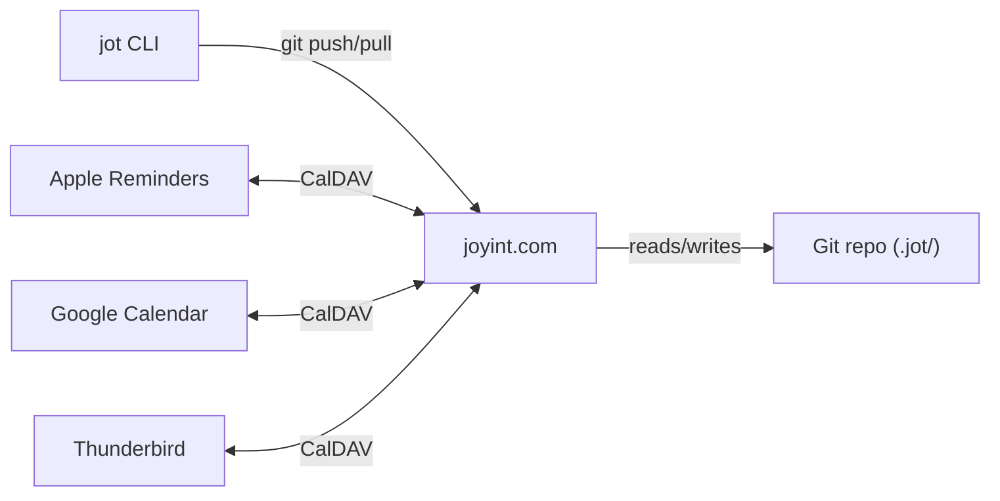

# joyint.com — Sync Platform

> For shared concepts (data model, identity, dispatch, principles) see [README.md](./README.md).
> For product-specific details see [joy.md](./joy.md) and [jot.md](./jot.md).

## Overview

joyint.com is the hosted platform for Joy and Jot. It provides Git hosting, WebUI, CalDAV, notifications, dispatch, and collaboration as a managed service. Self-hosting requires a commercial license for server components (see [ADR-008](../adr/ADR-008-open-core-licensing.md)).

The CLI tools and data format are always free and open (MIT).

---

## Git as Sync Backend

Joy uses Git as its sync backend. There is no custom sync protocol and no application database. See [ADR-004](../adr/ADR-004-portal-source-of-truth.md) for the architectural rationale.

- **CLI users** sync via `git push` / `git pull` -- no server needed
- **WebUI and CalDAV users** go through a thin REST API on joyint.com that executes Git operations server-side
- **Notification service** watches the Git repo for due dates and status changes

The server is a gateway to Git plus a cron for notifications. Not an application server with its own state. Last-write-wins with conflict detection handles the rare case of concurrent edits.

## Bring Your Own Git (BYOG)

Users choose where their data lives:

1. **joyint.com** -- Git hosting included, E2E-encrypted
2. **GitHub / Gitea** -- data stays in the user's own Git account, joyint.com provides services (WebUI, CalDAV, Notifications) on top

Both options deliver the same services. BYOG lowers the trust barrier: "We don't even want your data -- we just provide the service."

## E2E Encryption

All data on joyint.com is E2E-encrypted (AES-256-GCM). The key stays on the client device. See [ADR-006](../adr/ADR-006-client-side-encryption.md) for details.

**Encrypted:** title, description, comments -- everything that constitutes item content. **Cleartext metadata:** id, status, priority, due_date, timestamps -- needed for notifications and CalDAV scheduling.

CLI decrypts locally. WebUI decrypts client-side (Web Crypto API). CalDAV requires explicit opt-in from the user to allow server-side decryption for VTODO delivery.

## CalDAV as Mobile Bridge

Instead of building native mobile apps for Jot, joyint.com runs a CalDAV server that exposes Git-hosted tasks as VTODO resources. Apple Reminders, Google Calendar, and Thunderbird work as Jot frontends -- including Siri, Apple Watch, and widgets. No App Store, no 30% fee, no device testing.

VTODO covers Jot's requirements: title, description, due date, priority, status, reminders (VALARM), recurring tasks (RRULE), tags. For nested projects, the WebUI is needed -- CalDAV clients handle RELATED-TO inconsistently.

**Architecture:**

Bidirectional sync: completing a todo in Apple Reminders triggers a CalDAV PATCH, which joyint.com translates to a git commit. For a personal tool (one user, multiple devices), conflict resolution is straightforward.

## Dispatch Service

The dispatch service on joyint.com bridges Joy and Jot. It watches Joy project events and creates Jot todos in target users' repositories when status gates are reached.

**Responsibilities:**

- Watch Joy repos for status transitions that trigger gates
- Create Jot todos in the assignee's `.jot/` repository with `source` field linking back to Joy
- Route callbacks: when a dispatched Jot todo is completed, update the Joy item's gate status
- Support both human and AI agent dispatch (same mechanism, different assignees)

**Example flow:**

1. Developer submits Joy item JOY-002A for review (`joy submit JOY-002A`)
2. Dispatch service creates a review todo in the reviewer's Jot repo
3. Reviewer sees the todo in Apple Reminders (via CalDAV) or `jot ls`
4. Reviewer completes the review and runs `jot done TODO-000A`
5. Dispatch service signals Joy that the review gate for JOY-002A is satisfied

For AI agents, the same flow applies: the dispatch service creates a todo assigned to `agent:implementer@joy`, the agent picks it up via `jot ls --mine`, and marks it done after execution.

## Platform Components

| # | Component | Purpose | License |
|---|-----------|---------|---------|
| 1 | **Web UI** | Board, roadmap, dependency graph, item management (SolidJS) | Commercial |
| 2 | **API Server** | REST API, Git gateway, OAuth authentication | Commercial |
| 3 | **CalDAV Server** | VTODO bridge for Jot tasks to Apple Reminders / Google Calendar | Commercial |
| 4 | **Notification Service** | Due dates, status changes, mentions | Commercial |
| 5 | **Dispatch Service** | Joy-to-Jot bridge, status gate callbacks | Commercial |
| 6 | **AI Command Center** | Dispatch AI jobs, monitor agent progress, review and approve AI work | Commercial |
| 7 | **Native App** | Desktop (macOS, Linux, Windows) and mobile (iOS, Android) via Tauri | Commercial |
